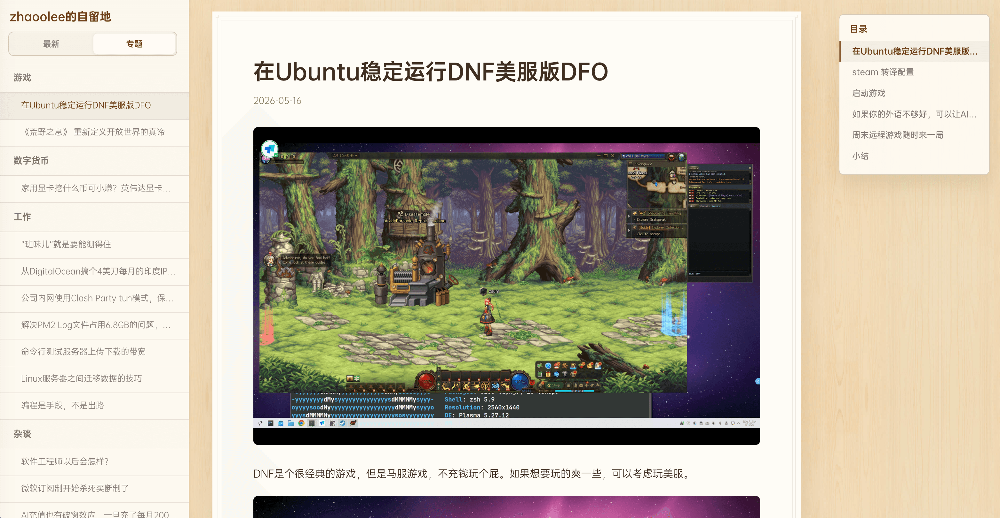

# 锤子便签风格的 Hugo 博客




## HUGO主题调优

- 支持按文章发布时间或专题查看
- Gitbook结构，左侧文章列表，右侧文章结构导航
- 文章与图片在相同目录，方便分享，Typora编辑友好


## 本地预览

```bash
hugo server --renderToMemory --noBuildLock --disableFastRender
```

## 构建

```bash
hugo
```

## GitHub Pages 部署

推送到 `master` 后，GitHub Actions 会自动构建并部署到 GitHub Pages。

仓库设置里需要选择：

```text
Settings -> Pages -> Build and deployment -> Source -> GitHub Actions
```

自定义域名使用：

```text
zhaoolee.com
```

## 新建文章

```bash
hugo new content chat/2026-06-04-new-post
```

新文章会生成 Hugo leaf bundle：

```text
content/chat/2026-06-04-new-post/
├── index.assets/
│   └── .gitkeep
└── index.md
```

用 Typora 打开 `index.md`，图片复制位置设置为：

```text
./index.assets
```
