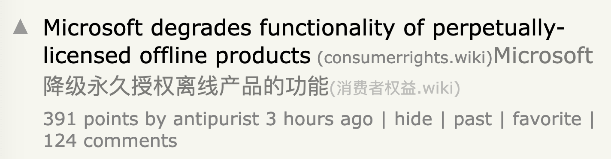
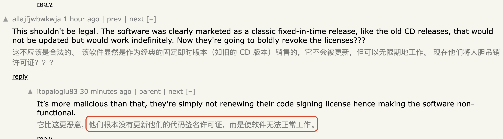
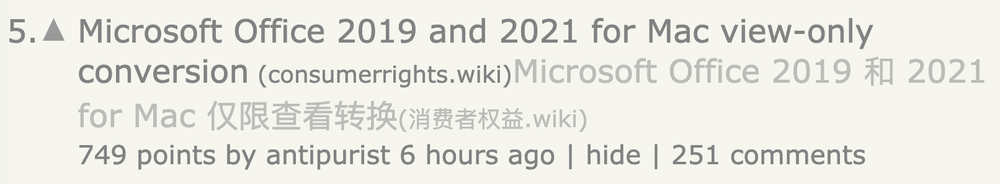
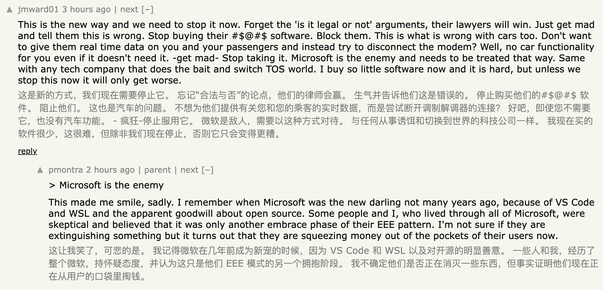

# 微软订阅制开始杀死买断制了

最近在 Hacker News 看到一则新闻：微软开始强制关闭买断制 Office 的使用权限，文档只能阅读，不能编辑。

说白了，这就是在让买断制软件慢性死亡。

微软已经尝到了订阅制的甜头，所以它可能会想办法逐渐消灭买断制。

Office 这么多年下来，本来也没有多少真正必须更新的功能。

如果你选择买断制，就意味着你可以长期不用再交钱，也能继续使用自己需要的功能。

但微软现在的做法，是想办法把这些已经买断的软件直接干到不能用。

这样一来，你就不得不继续付费，去使用它的订阅制。

我认为这种做法非常恶劣。

对微软来说，订阅制确实可以让财务报表更好看。

但 Office 是一个几乎绕不开的办公场景。把这种基础办公能力变成一个长期付费服务，无论对于公司，还是对于个人办公者来说，都会非常难受。

具体的做法也很简单。

尤其是在 Windows / macOS 这种操作系统上运行 Office，并不是安装完成就结束了。

这个软件有一个授权证书，而证书是会过期的。

如果到期之后微软不续期，这个软件就可能不再被操作系统认可，从而变成一个“危险软件”。

这本来是用户买的正版软件。

但只要微软不给续期，它就会变得像没有 HTTPS 认证的网站一样。

虽然续期的成本对微软来说非常低，但它就是不想做。

目的也很明显：让买断制软件逐渐变得无法使用。

从软件开发者，或者软件公司的角度来说，订阅制当然更舒服。

它能让财务报表更稳定，也能让公司更有动力继续维护软件。

但从消费者的角度来说，我其实更倾向于只使用已有功能，然后通过一次性付费买断。

这种模式最让人心安。

问题是，消费者往往没有什么话语权。

如果开发者强制要求所有功能都必须订阅，不持续付费就无法使用，那么消费者就会变得非常被动。

所以，对于一些软件来说，如果能使用开源版本，当然是最好的。

开源软件意味着你可以自己做决定。

甚至在必要的时候，你可以自己给软件签名，从而保证它在自己的系统上一直可以运行。

我直观感觉，微软这几年做的东西是越来越差的。

不管是 Office，还是 Windows，都是这样。

Office 方面，最近 Claude 推出了一个插件，可以让人通过 AI 大量完成原本需要在 Office 里人工操作的工作。

微软作为第一方开发商，在设计上却没有 Claude 这种第三方做得好。

我认为这说明微软的开发能力，或者说开发工作流，正在变差。

Windows 方面，微软一直在尝试把 AI 和 Windows 结合起来。

但因为搞得并不顺利，所以情况可能更糟。

Windows 更新次数非常多，但每次更新都没有让它变得更好用，反而让它变得更难用。

我把个人台式机换成 Ubuntu，已经两年了。

平时我偶尔还需要一些 Windows 软件，比如 PotPlayer 这种播放器。

后来我发现，完全可以用 Steam 的兼容层去运行它们。

Steam 本来是为 Windows 游戏做兼容层的，但现在其实也可以用来运行普通 Windows 软件。

如果你对 Windows 操作系统本身不是很满意，可以尝试切换到 Ubuntu，然后在里面装上 Steam。

它的兼容层可以帮你运行不少 Windows 软件。

我认为 Steam 的兼容层维护得很好，而且 V 社非常有动力去维护它，因为它需要卖游戏。

这个东西是免费的，现在已经可以把它当成一个小型 Windows 来用了。

我认为订阅制会变得越来越多。

但订阅制越多，反而可能会让一些开源软件变得更容易生存。

因为开源软件的源码是开放的，大多也是免费的。

你可以自己拿到一个免费版本，而不用频繁地为一个自己并不需要的更新付费。

我认为世界上愿意为软件付费的人，或者愿意为某个软件付费的人，数量可能就是一定的。

并不会因为你把离线版干掉，就能收获更多付费用户。

如果微软 Office 真的全面转向订阅制，体验还这么差，那些原本就在使用离线版 Office 的人，真的会去订阅吗？
