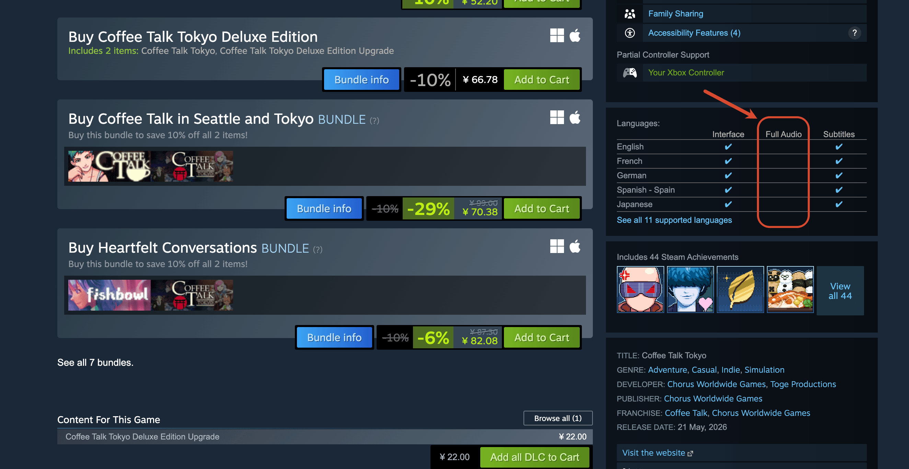
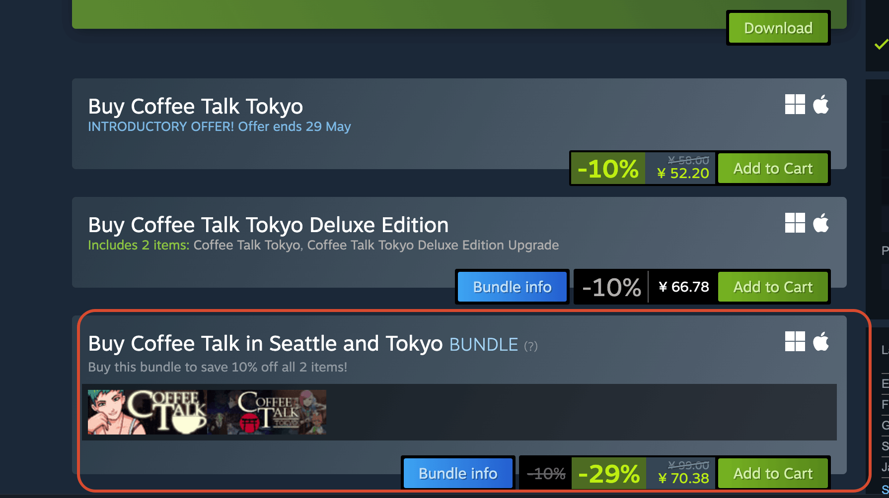
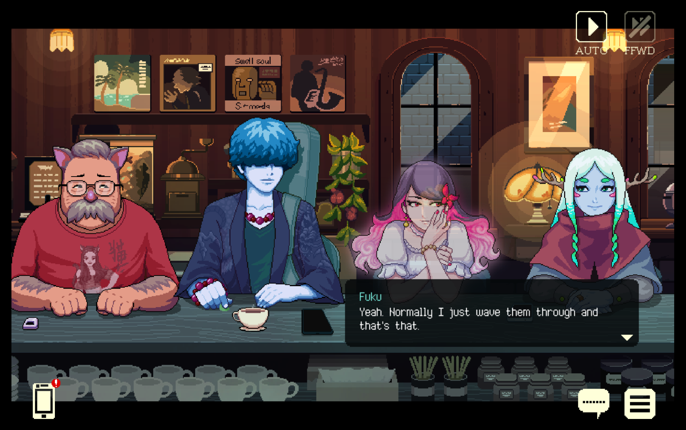

今天和一个朋友聊到做一款微信的小游戏。

盈利的模式就是角色死亡之后可以通过看广告来复活。

主要原因就是在微信这个圈层内，付费的意愿真的是太差了，可能 6 块钱首冲就已经是一个游戏的付费巅峰了。

如果你做 Steam 平台的游戏，可能就不太一样。

一个类似于短剧剧情的小游戏，里面的角色不断地对话（甚至都不用加配音），玩家不断地点击选项。这种游戏在 Steam 里面基本上可以卖到 30 块到 50 块，如果是打包两部作品的话，甚至可以卖到 70 块。

## 一个成功游戏产品的特质

1. 这个游戏能让玩家感觉到快乐。
2. 这个游戏很酷，需要一点儿门槛，玩一个不够大众的东西，这样会给人一种优越感。
3. 这个游戏 IP 本身是能够赚钱的。比如说它可以产生一些实物的衍生品，就像宝可梦的集换式卡牌全收集一样。不仅厂商能赚钱，核心玩家通过收集一些绝版的衍生品，可以让财富增值。

## AI做游戏的思路

1. AI 适合剧情类的游戏，由人类写剧本，然后由 AI 去丰富里面的人设与细节，最好是悬疑题材，这样能够吸引玩家一直玩下去。
2. AI 游戏适合做买断式的处理，而不是免费试玩。只有通过付费拉高门槛，才能筛选出真正有付费能力的玩家。
3. AI 游戏需要打造 IP。游戏有对应的实物衍生品，实物衍生品可以通过渠道去购买、销售，以及造成一种相对的稀缺性，让衍生品能够成为一种炒货的对象。
