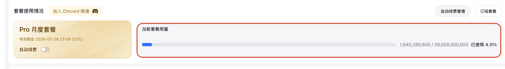
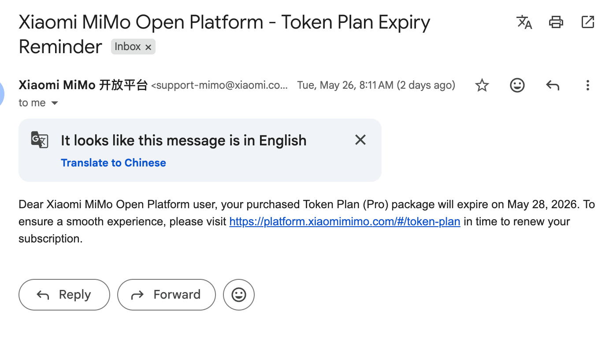
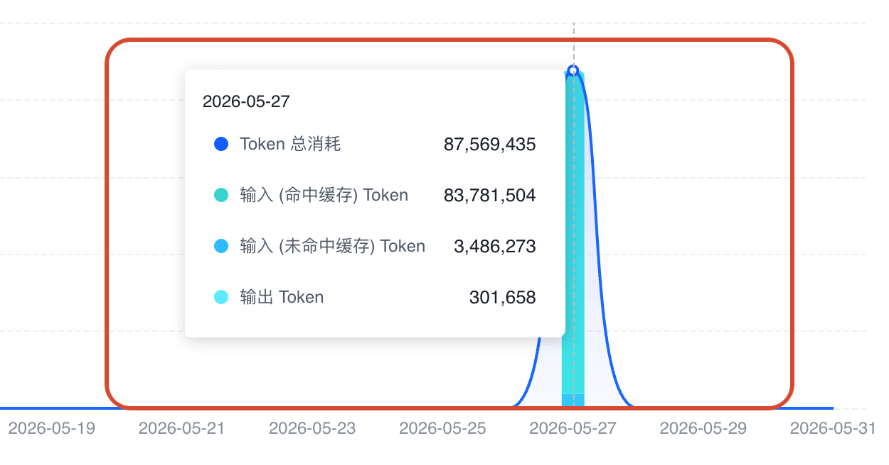
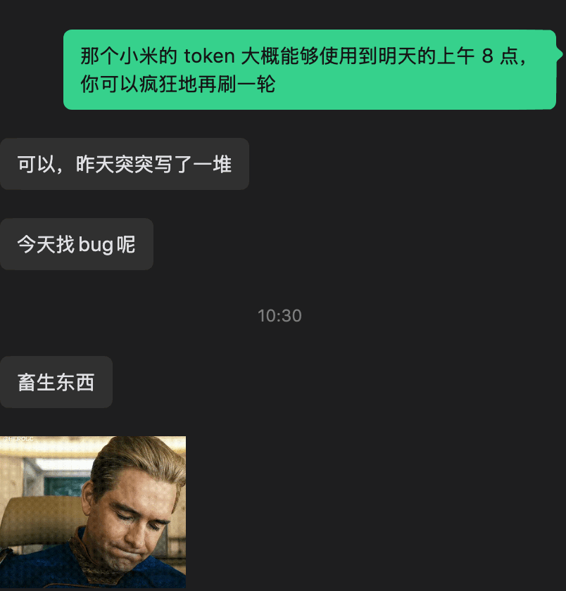
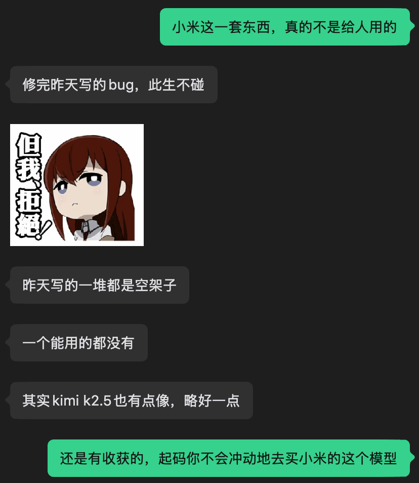
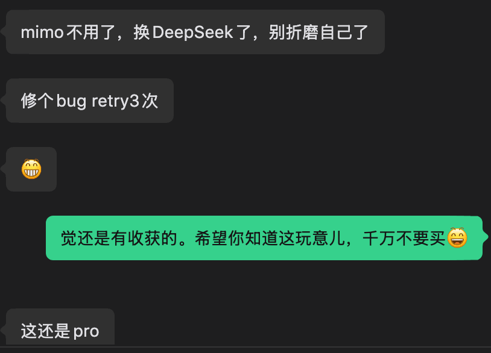
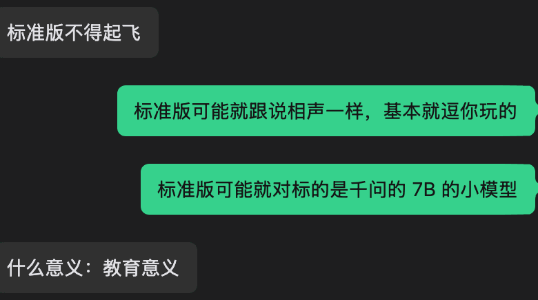
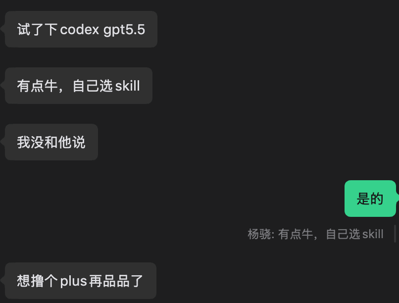

前段时间，小米送了一个月的模型体验。我第一天用的时候，发现这个东西实在是太慢了，拿到 Token 后的第一个请求就直接超时。

后来我又坚持用了一天，最终还是没法用下去，因为实在太卡了。放在 Claude Desktop 里面用，基本就是一直超时。

昨天我收到邮件，小米提醒我说体验快到期了，如果需要续期就赶紧申请。

我想了想，反正额度也没怎么用，就转给了一个正在做独立小游戏的朋友。我说这个 Token 反正也用不完，还剩一两天时间，让他拿去疯狂刷一下。

我那个朋友可劲刷了一天，大概刷了 8000 万 Token。

第一天感觉还比较满意，第二天我告诉他还能接着刷，结果他反馈说：

1. 昨天用这个模型写了一堆代码，结果全是一堆 Bug，今天光顾着改 Bug 了。
2. 虽然小米说这个模型很便宜、效果很好，但实际成本更高。因为你不但要在使用过程中不断面对超时、浪费时间，好不容易跑通了，写出来的还全是 Bug。
3. 他仔细检查后发现，昨天写的东西基本都是一堆空架子，一个能用的都没有。

我朋友的原话是：“这模型也太畜生了，根本用不了。”他觉得这比 GLM 还是差得远。其实你看现在的市面上，智谱的市值都超过小米了，小米做的这个模型真的是太拉了。

后来他又试了一下 GPT5.5，感觉效果还不错。之所以觉得好用，是因为对比下来，GPT5.5 可以自己去找 skill，搞定一些复杂的编码任务，用起来确实比较爽。他甚至想为了这个去充个每月 20 美刀的 Plus 会员，再仔细品评一下。

所以这件事给我的感悟是：

1. 如果你真的要用大模型技术去写代码，一定要用一流的 Token，不能图便宜。
2. 便宜的东西是有代价的。它产出一堆垃圾和 Bug，会导致你的维护成本更高，简直得不偿失。

最后奉劝大家，买 Token 一定要买真的一流的，而不是哪个便宜用哪个。否则不仅耽误时间，还会给你造成不必要的麻烦。

我们买 Token 写代码是为了节省时间，而不是为了浪费时间，节省自己的时间去享受生活, 这才是最重要的。

另外我感觉小米这个东西简直是太搞笑了。

别人给试用，都是说试用完成之后用户就购买了；

你这个给了试用之后，用户就再也不想用了，你这个模型效果这么差，你试用的目的是什么呀？
