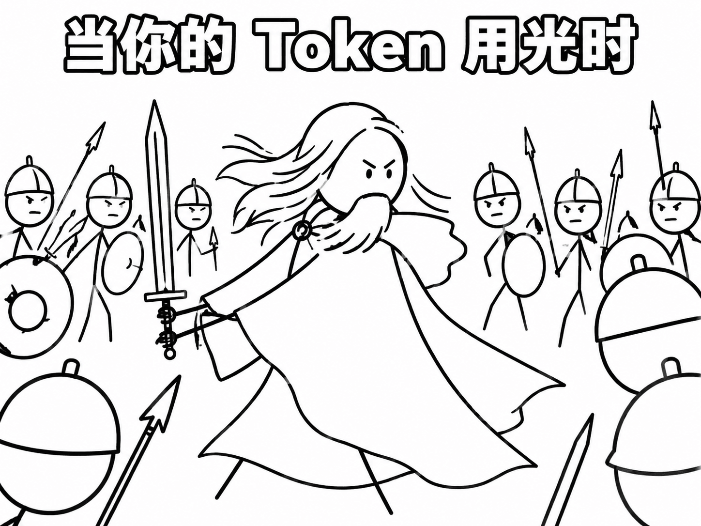

自从 AI 大模型变强之后，有些人认为 AI 可以搞定一切(当然可能是想降本增效找个由头),比如销售这件事，竟然也有人认为可以通过 AI 来复刻无数个“销冠”。

虽然我觉得这事儿极度不靠谱，但确实收到过类似的需求，要求用智能体来实现复刻销售冠军。收到这种需求后，我第一个想法就是：上班就是这么回事，你想干下去，就得能“绷得住”。

面对这类让人蛋疼的需求，如果你当场翻白眼，可能就要被开除了。

如果你能绷得住，或者选择戴个墨镜让别人看不见你的眼神，你就能坚持下去，继续领工资。

当然，有天赋也行，比如你眼睛长得特别小，即使眼神飘忽，别人也发现不了，还以为你在认真听。

虽然大家都知道有些东西就是在扯淡，但你还是得陪着演下去。

我记得在前 AI 时代，AI 还没那么强的时候，我就收到过一些奇葩需求。比如：要求用 AI 监听并检测销售人员陪客户喝酒时的细节
  (a) 酒杯举了多高
  (b) 酒倒了多少
  (c) 将这些数据全部量化出来

当时很多开发人员见了这种需求都惊为天人，说干脆搞个机器人去敬酒得了。甚至还有人开玩笑说，机器人做出来之后得找个测试工程师陪它喝，等到测试工程师喝喝倒了就能下班。

我本以为这种离谱的事遇到一次就到头了，没想到最近又收到一个类似的：**想复刻销售冠军，实现批量产出，为业务助力**。

归根结底，如果你想上班，最重要的就是能绷得住。要么戴墨镜，要么眼睛小，要么能完全控制住面部表情以及眼神——这就是你的道行。
