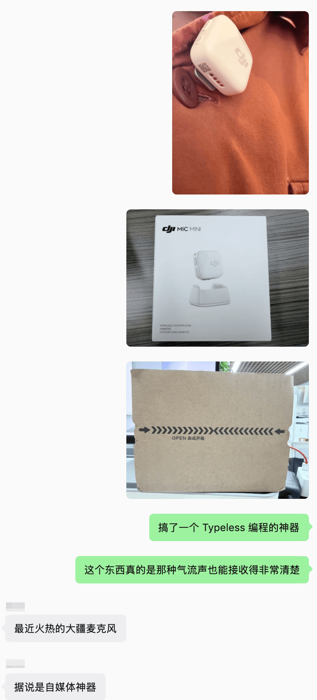
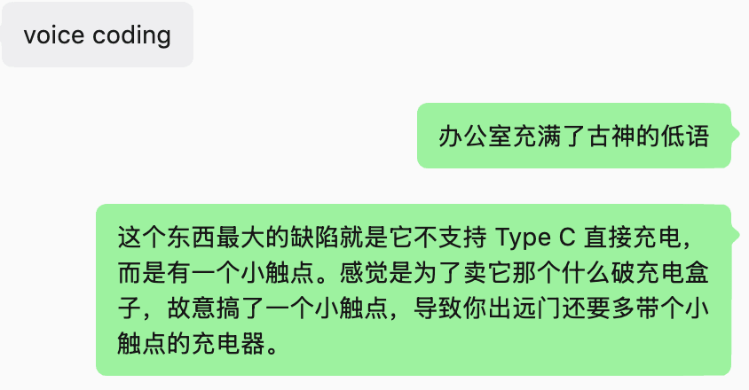
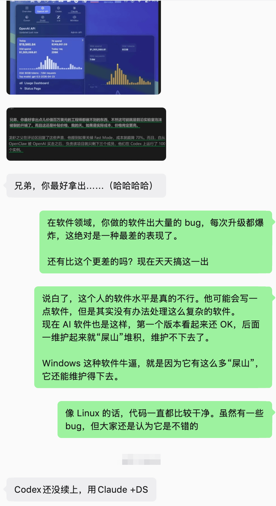
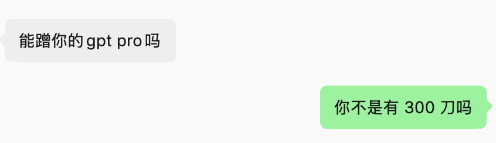
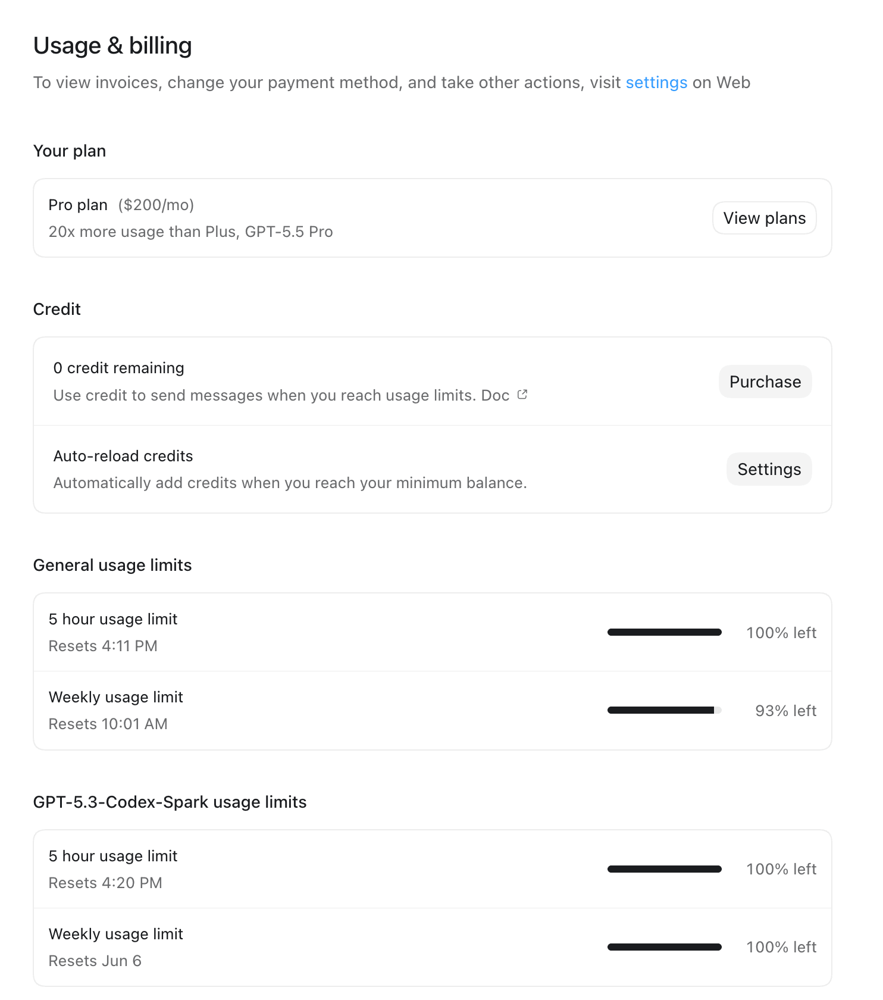
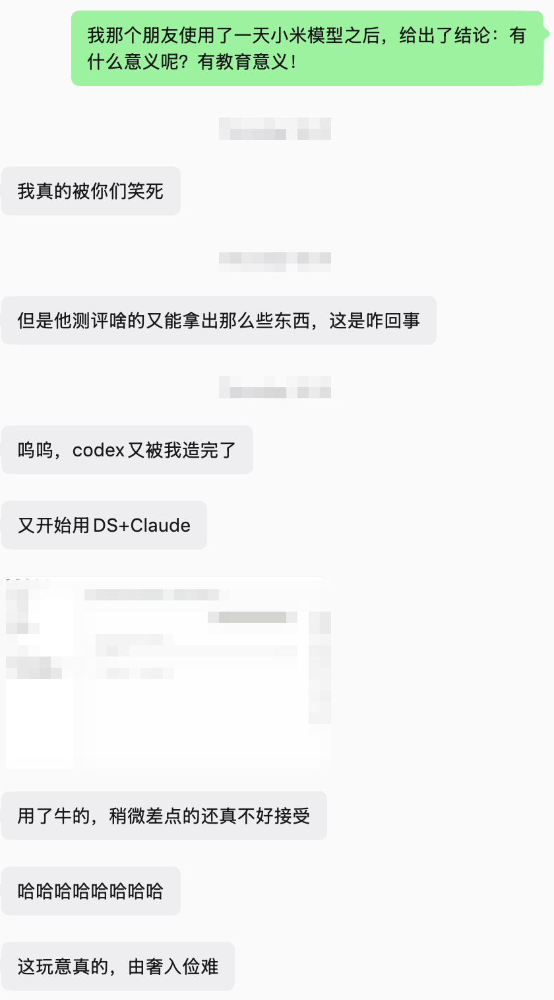
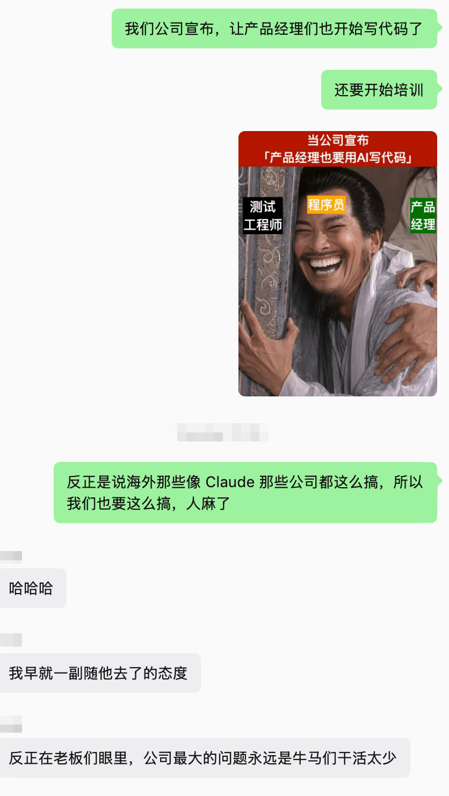
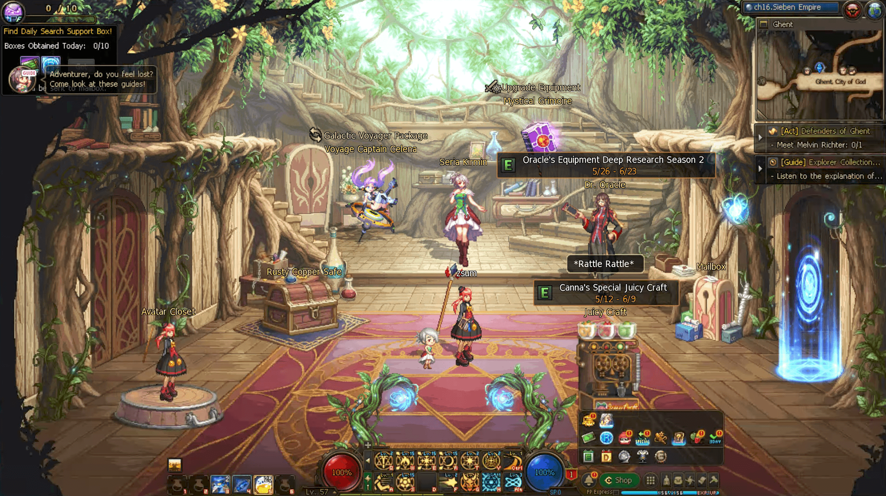

我记得 AI 刚出来的时候，大家都很保守，都在使用免费模型。后来免费模型的限制变得很厉害，于是大家就开始充值，每个模型 20 刀，用得也很爽。

但后来发现，这 20 刀的模型好像也不够用了，就得额外再去买 API key，比如 DeepSeek、通义千问，以及量大管饱的 GLM 订阅。

这些开销好像也能接受，但我慢慢发现一个点：一旦你每个月在 AI 上充值达到 200 刀，有时候就很难再回到消费更少的状态了。

因为 200 刀一定会给你更快的速度，让你获得一种非常优秀的用户体验，你可以不用等待，AI 可以马上帮你做到很多事。（虽然这些事做完之后，也不一定真能赚钱。）

一旦你脱离这种消费模式，就会感觉非常别扭，这可能就像是在戒掉某种瘾一样。

我感觉大模型这套服务最诡异的一点，就是它把消费变成了一种进步的方式。

但其实消费就是消费，和你进不进步没有关系。你消费了、输入一段 prompt，AI 产出了一些代码，并不代表你进步了。

我现在就在想，其实自掏腰包花 200 刀买的服务，如果不能为你赚到钱，那这个东西其实没有太多价值。

AI 目前的这套消费模式，并不是没有成本的，长期搞下来，是会消耗精力的。

你的精力都花在琢磨“怎么让我买的这个东西更值”上：
1. 每天要花多少亿个 token 才算把钱花够？
2. 每天研究某个软件需要消耗多少 token？而不是这个软件到底能不能卖出去。

人的精力是可以由自己支配的，而不是一定要投给 AI，比如去公园转转，或者去看看电影，做一些户外运动，看看书。

根据我最近的观察，我发现周围喜欢用 AI 的人，现在的状态更像是单纯的探索，而不是真正的学习。AI 确实非常擅长探索，但只是探索的话其实是赚不到钱的；你可能探索十年，最后也是一事无成。

如果你真的想做一个东西，是要投入时间去深入学习和研究的。你大量使用 AI，其实只是在用战术上的勤奋，来掩盖战略上的懒惰。我认为 AI 最大的副作用，就是它会把你本该用来思考的时间吞掉。

## 一些不够成熟，但非常有用的方法

既然已经订阅了 200 刀，甚至已经上瘾了，该怎么办呢？我感觉最好的办法就是接受“这个东西可以停下来”：
1. 哪怕今天还有很多额度没用，也要选择不去用它。
2. 坚持第一天不用，第二天不用，第三天不用。

慢慢地，当你真正需要的时候偶尔用一下，就能以一种相对平常的心态去看待 AI 了。

并不是说一定要买很多 AI 服务才能赶得上技术浪潮。

AI 到底算不算一个浪潮，其实还有待验证；它可能是一门新兴技术，但绝不是现阶段就能彻底改变你生活的那种技术。

如果你每天把大量时间投在 AI 探索上，一旦有了一些额度，就一定要疯狂地用掉，生怕它过期。这种心态其实是非常不健康的。

我觉得很多那种 AI 精神病，就是把那种 DNF 玩游戏刷疲劳值的心态带到了 AI 上，每天有了疲劳值就一定要用光，不然就感觉自己好像错过了非常多，甚至会有一点点的沮丧。

我感觉这种就特别像那种短视频里的乐子，人生到处都是关键点：一年级是关键点，二年级是关键点，直到死之前都是关键点。

如果你想在享用 AI 带来便利的同时也能享受生活，可以参考以下三点：

1. 允许 AI 的额度被浪费掉。
2. 真的有需求时再去用它。
3. 不要每天盯着额度，想着赶紧把它清空，即使你清空了额度，对你长期的发展也没有什么益处。

有一些非常极端的人，如果没有把每月 200 刀对应的 20 倍 token 完全用到极限，就沮丧到抬不起头。

我觉得吧，如果你特别享受刷 token 的快乐，你还不如直接打开 DFO（国际服 DNF），开 20 个小号刷疲劳值。开 20 个小号刷完疲劳值，直接可以拿很多金币，然后拿着金币去换美元。

如果你每天都处于那种焦虑当中，这个 AI 浪潮到底能不能带你起飞，都已经不重要了。因为你活着本身就不快乐，起不起飞，对于一个不快乐的人又有什么意义呢？
