## 1. 如何提升挖矿效率？

挖矿效率 = 投入的费用  / 消耗时间

### 1. 使用专业的 ASIC 矿机

Application-Specific Integrated Circuits (ASICs) are designed specifically for cryptocurrency mining and are more efficient than GPUs or CPUs. ASIC miners are optimized for SHA-256, while GPUs work well with algorithms like Ethash

ASIC是专门用来开采加密货币的矿机，比普通的GPU和CPU采矿更有效率。ASIC对计算 SHA-256 做了硬件优化，适用于 Ethash等算法。

### 2. 开源高效的采矿软件

**CGMiner** https://cgminer.info/  开源 https://github.com/ckolivas/cgminer (Public archive 已归档)

**NiceHash**  https://www.nicehash.com/nicehash-miner 开源  https://github.com/nicehash/NiceHashMiner

**BFGMiner** 开源 https://github.com/luke-jr/bfgminer 

### 3. Mining Pool , 使用矿池集群

1. 集群算力越强，越有可能在更短的时间算出正确的区块。
2. 统一同步区块，减少同步区块的带宽占用
3. 挖币需要优质的科学上网，国内的网络同步区块信息都困难

商业化集群方案:

https://hiveon.com/

开源方案：

https://github.com/MPOS/php-mpos

https://github.com/zone117x/node-open-mining-portal

### 4. 便宜的电力

便宜的电力是矿场的基础，有些人使用太阳能板，获取廉价电力，矿机电源要求高能效。

WhatToMine：一个挖矿收益计算网站，用户可以输入显卡型号、电费等参数，计算不同加密货币的挖矿收益，帮助矿工选择最有利可图的挖矿方案 https://whattomine.com/

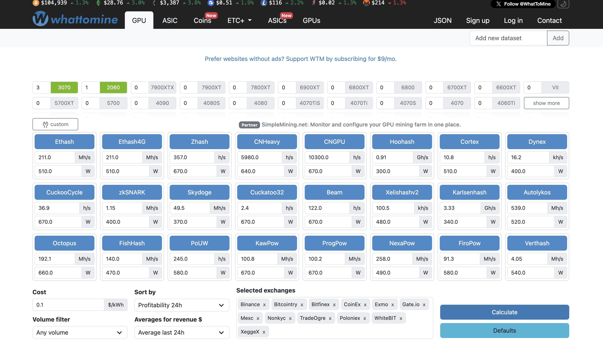

MinerNav：一个专注于加密货币挖矿的资源导航站，提供全球太阳能数据、设备交易、算力交易等多种资源，帮助矿工获取最新信息和工具

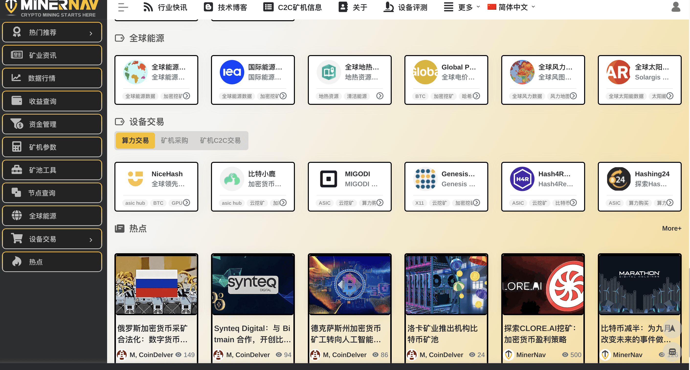 

### 5. 矿场主要紧跟热点

Ethereum’s shift from proof-of-work to proof-of-stake 
以太坊从工作量证明转向股权证明

Mining popular coins like Bitcoin might be less profitable due to high difficulty，Explore less competitive altcoins that may offer better returns
比特币的挖掘收益越来越低，竞争较小的新币，往往能获得更大收益。实时加密货币行情网站，提供市场概览、价格走势等信息，方便矿工了解市场动态 https://coin360.com/

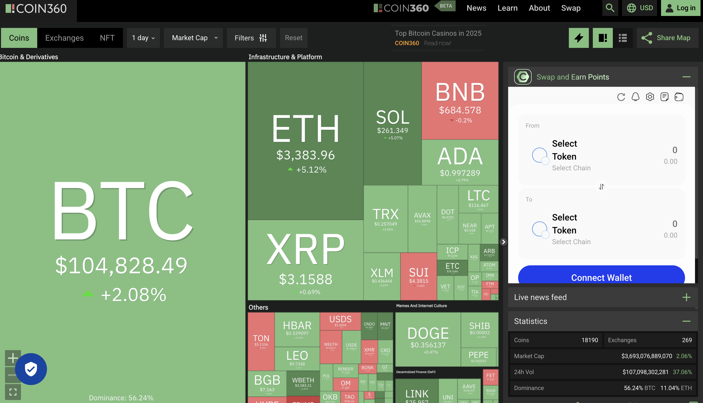

## 2. 比特币旗舰矿机类型、配置

### 旗舰矿机选购

| 旗舰矿机                          | 算力 | 效率    | 价格      | Price/T | 购买                                                         |
| --------------------------------- | ---- | ------- | --------- | ------- | ------------------------------------------------------------ |
| Antminer Bitcoin Miner S21 XP Hyd | 473T | 12J/T   | $14,521   | $30.7   | https://shop.bitmain.com/product/detail?pid=000202406200044065805TcPB8mt0682 |
| MicroBT WhatsMiner M66S++         | 348T | 15.5J/T | $8665.2   | $24.9   | https://shop.whatsminer.com/products/details/76?skuId=171    |
| Canaan Avalon Miner A1566         | 185T | 18.5J/T | $2,701.00 | $14.6   | https://shop.canaan.io/products/avalon-miner-a1566-185t-3420w-november-future?VariantsId=1035 |

全网比特币哈希算力历史统计： https://www.coinwarz.com/mining/bitcoin/hashrate-chart

算力新闻 https://www.binance.com/zh-CN/square/post/01-04-2025-bitcoin-hashrate-reaches-record-high-nearly-doubling-in-a-year-18465287530681

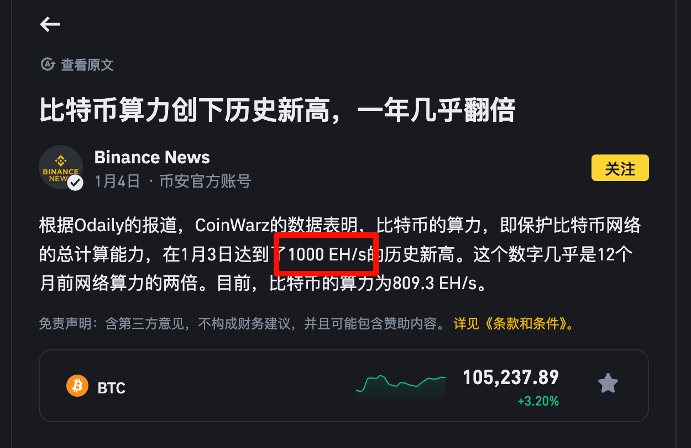

算力换算 https://tools.bitbo.io/hash-converter/

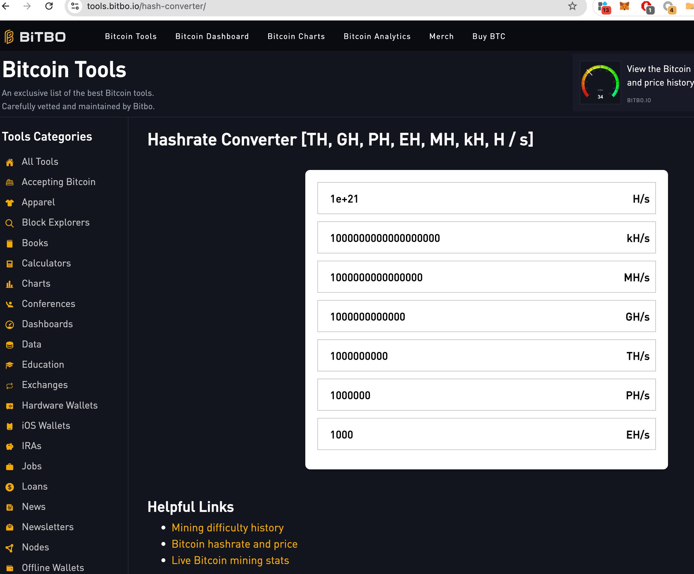

全网大概有多少台1万4千美刀的机器（Antminer Bitcoin Miner S21 XP Hyd）在跑比特币？

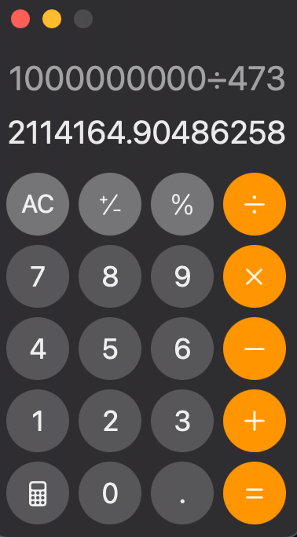

如果没算错的话，相当于 211万台 Antminer Bitcoin Miner S21 XP Hyd同时挖矿！ 

### 民用级RTX显卡挖比特币毫无性价比

RTX 4090只有 124.70 MH/s，挖比特币基本毫无性价比

| 旗舰矿机                          | 算力             | 效率               | 价格    | Price/T |
| --------------------------------- | ---------------- | ------------------ | ------- | ------- |
| Antminer Bitcoin Miner S21 XP Hyd | 473T             | 12J/T              | $14,521 | $30.7   |
| RTX 4090                          | 0.00012-0.00013T | 600,000-700,000J/T | $1,599  | $13,325 |
| RTX 5090                          | 0.00014-0.00015T | 500,000-600,000J/T | $2,000  | $14,285 |

### RTX 4090挖矿能每天能赚多少？

如果电费能控制在 0.05美元/kWh，可以挖一些不太热门的币，显卡挖矿推荐站 https://theminerbay.org/ 不过收益确实也不高，RTX4090显卡挖Ethash， 如果电费能控制在三毛钱左右，一天能赚10块钱左右， "Ethash (MPH)" 表示使用 Ethash 算法进行挖矿，并且矿池是 MiningPoolHub。

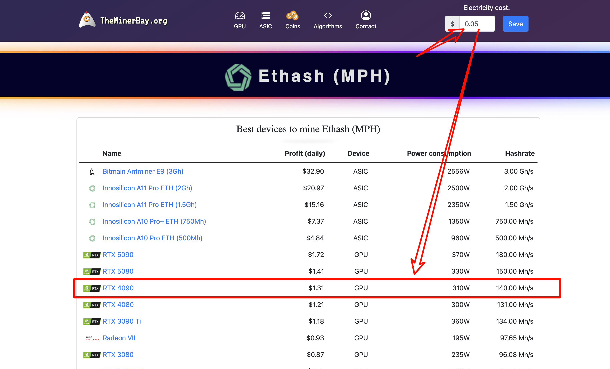

## 3. 不同加密算法对应的加密货币，以及加密算法对应的矿机

| 算法       | 币种                                                         | 矿机系列                                                     |
| ---------- | ------------------------------------------------------------ | ------------------------------------------------------------ |
| SHA-256    | 比特币(BTC)                                                  | 参考上文 **比特币旗舰矿机类型、配置**                        |
| Ethash     | 以太币(ETH)                                                  | [ETC Miner](https://shop.bitmain.com/?coin=ETC)              |
| Scrypt     | 莱特币 (LTC), 狗狗币(DOGE)                                   | [Litecoin Miner](https://shop.bitmain.com/?coin=LTC%2BDOGE%2BBELLS%2BJKC%2BLKY%2BPEP) |
| kHeavyHash | 卡斯币(KAS)  特点：Kaspa is the fastest, open-source, decentralized & fully scalable Layer-1 in the world  并行链，高吞吐量 | [KAS Miner](https://shop.bitmain.com/?coin=KAS)              |
| RandomX    | 门罗币(XMR) 特点：Private, decentralized cryptocurrency that keeps your finances confidential and secure  隐私性好 | [XMR Miner](https://shop.bitmain.com/?coin=XMR)              |

Tip:关于以太币（ETH），PoW（Proof of Work 工作量证明） To  PoS（Proof of Stake 权益证明）,  后面逐渐不能通过挖矿获取收益，但ETC（以太经典，原教旨主义者）仍然保持工作量证明（PoW）

## 4. 成本收益（2025年2月5日计算得出，仅做参考）

### 挖BTC比特币收益

目前最强比特币矿机Antminer Bitcoin Miner S21 XP Hyd计算的挖矿收益

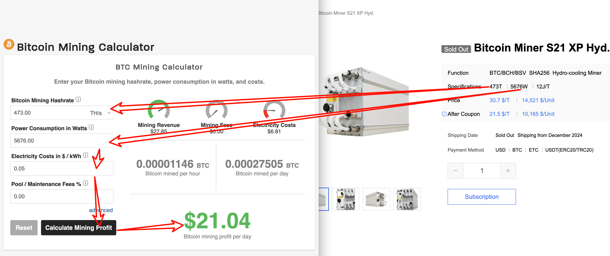

以每一度电，0.05刀计算

页面来源 https://www.coinwarz.com/mining/bitcoin/calculator?h=473.00&p=5676&pc=0.05&pf=0.00&d=108105433845150.00000000&r=3.12500000&er=1&btcer=101239.39220000&ha=TH&hc=13699.00&hs=-1&hq=1

Antminer Bitcoin Miner S21 XP Hyd 大概每天挖比特币收入21刀！ 矿机售价14512刀，回本需要692天!

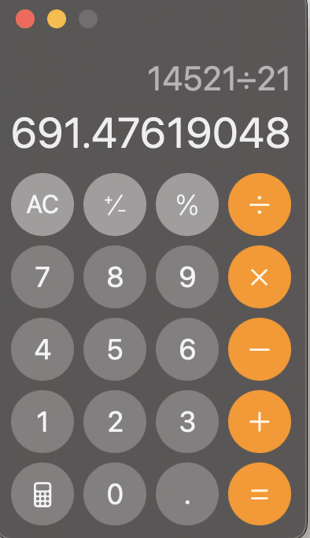

官网购买使用优惠券后（打七折）， 483天矿机回本！（批量采购，不知道是否可以七折购买）

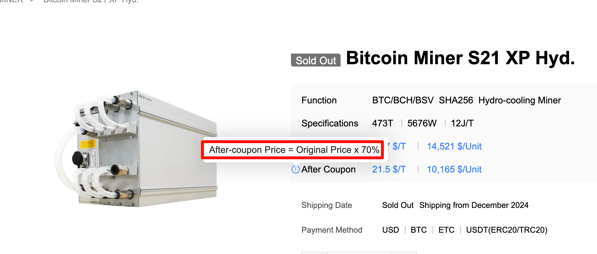

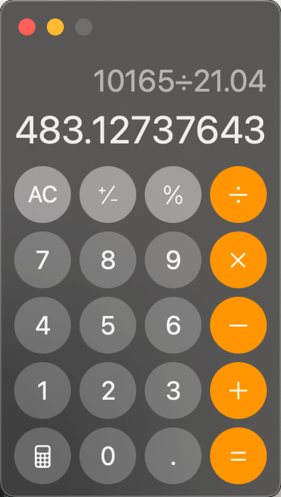

总结：比特币矿机Antminer Bitcoin Miner S21 XP Hyd，每台投入10165美元，电费0.05美元，大约483天回本。

### 挖DOGE狗狗币收益

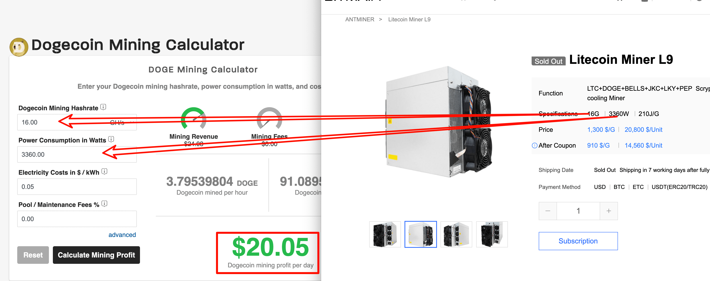

https://www.coinwarz.com/mining/dogecoin/calculator?h=16&p=3360&pc=0.05&pf=0.00&d=35335016.08423600&r=10000.00000000&er=0.00000271&btcer=97568.25330000&ha=GH&hc=14,560&hs=-1&hq=1

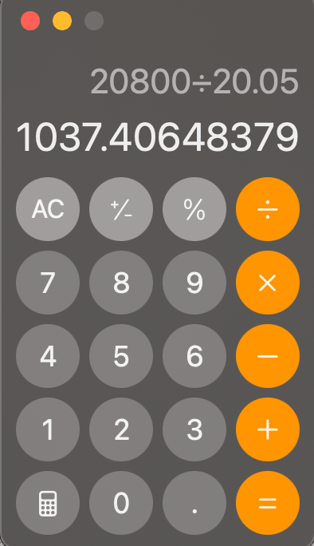

打折后

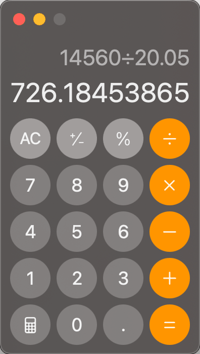

原价矿机1037天回本！（同理使用优惠券，回本天数能打七折，也就是 726天回本）

狗狗币矿机Litecoin Miner L9，每台投入14560美元，电费0.05美元，大约726天回本。

### 实现收益最大化，挖MiningPoolHub的思路（矿池混挖）

按照 theminerbay 的数据，收益排名靠前矿机，都在挖MPT，也就是MiningPoolHub矿池挖矿

**MiningPoolHub**是一个支持多种加密货币挖矿的矿池。它允许矿工选择不同的加密货币进行挖矿，包括基于 Ethash 算法的币种，如以太坊（ETH）和以太坊经典（ETC）。**MiningPoolHub** 挖矿和**投资标普500**在某些概念上有相似之处，目标是分散风险，长期投资。

MiningPoolHub官网: https://miningpoolhub.com/  （没设备玩不了）

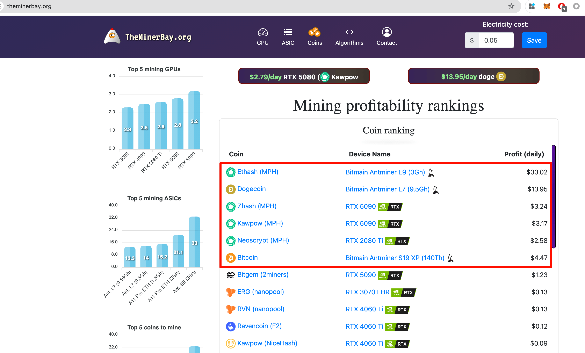

不过 theminerbay 的矿机型号不是最新的，新型号有更好的功耗控制，电量消耗更低

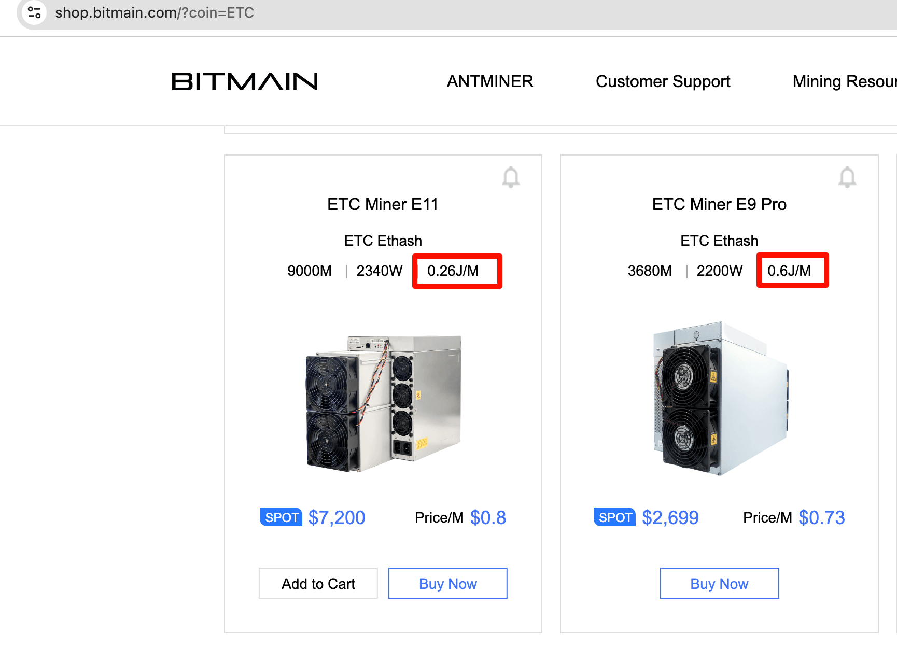

#### 老式矿机ETC Miner E9 收益计算

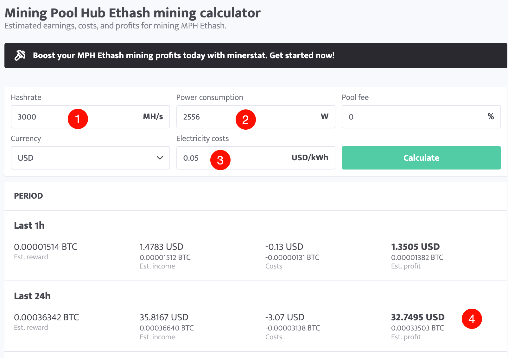

Tip: 在minerstat计算的值，和 theminerbay 理论的收益有差距，theminerbay 的收益为33.02美元/日 ，而minerstat的收益为32.74美元/日（minerstat电费为0.05美元/kWh，theminerbay的电费为0.1美元/kWh），需要实机验证后，给出结论。

#### 最新普通矿机ETC Miner E9 Pro收益计算

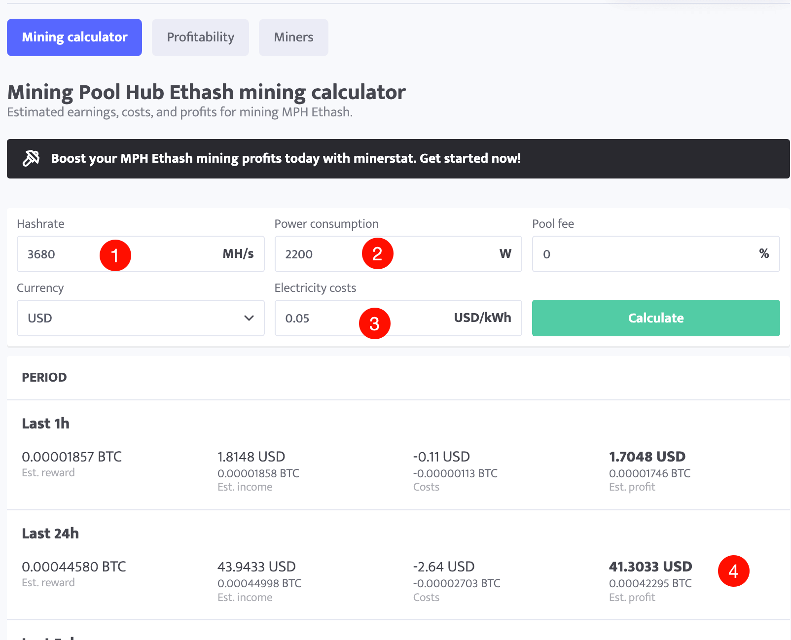

#### 最新旗舰矿机ETC Miner E11收益计算

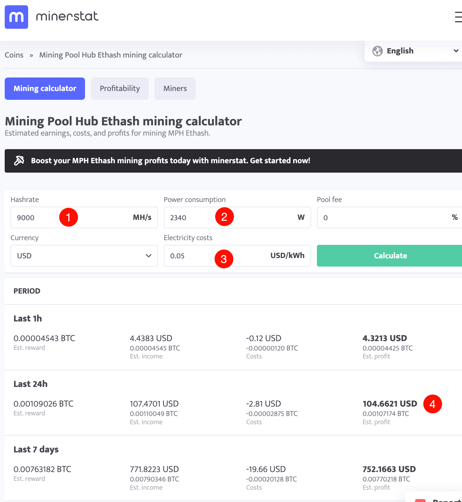

在线计算MPH收益：https://minerstat.com/coin/MPH-Ethash

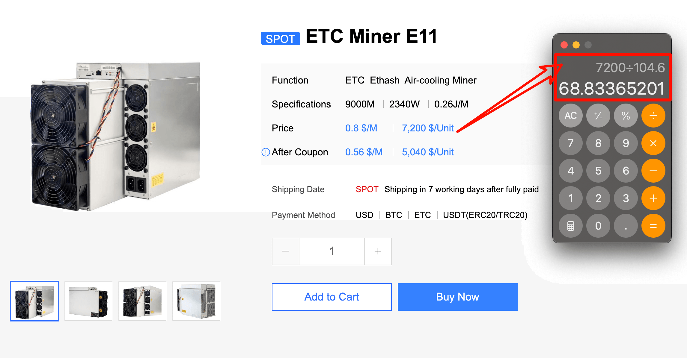

折后48天回本

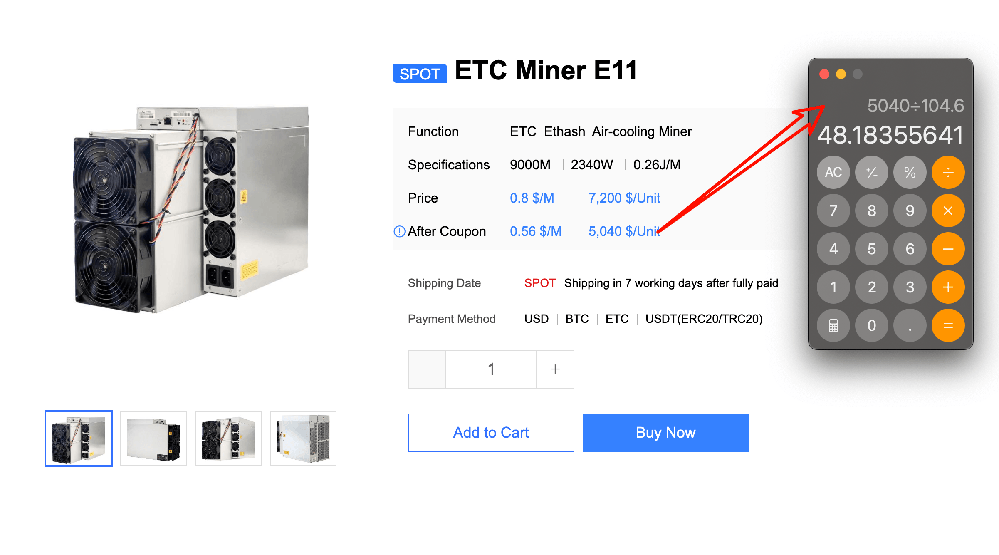

ETC矿机ETC Miner E11，每台投入5040美元，电费 0.05美元/kWh，大约48天回本。

以上对于 MiningPoolHub 的收益，是理论计算，具体的收益，需要采购机器后，进行测试。

## 5. 成本收益计算小结：

比特币矿机Antminer Bitcoin Miner S21 XP Hyd，每台投入10165美元/kWh，电费0.05美元/kWh，大约483天回本。

狗狗币矿机Litecoin Miner L9，每台投入14560美元，电费0.05美元/kWh，大约726天回本。

ETC矿机ETC Miner E11挖MPH，每台投入5040美元，电费 0.05美元/kWh，大约48天回本。

## 6. 挖矿潜在的风险

**矿机每年都在推陈出新**，目前矿机的回本周期为483天，新的矿机出现，全面碾压老矿机，回本周期会更长

**矿池垃圾币能否落袋为安**，挖MPH每日收益可观，其中包含大量垃圾币，能否落袋为安

**比特币产量的不确定性**，挖比特币本身存在竞争，如果算力一直增长，不添加新矿机，收益会降低。

加密货币市场，与传统金融系统相比，不受监管，没有交易合规审查，也没有可靠的风控精算评估，可以毫无逻辑的进行价格波动，收益不算稳定，风险极高。

## 7. 目前需要解决的问题

- 稳定的科学上网线路（目前阿里云新加坡的线路，非常随缘，不够稳定）
- 便宜的电力  (0.05$ / kWh)
- 类似基金经理，研究员，交易员的角色，管理钱包，并完成基础的交易
- 无米之炊，没有矿机，4090也在报修，挖矿技术预研阻塞严重

## 8. 挖矿科普视频

什么是矿池：https://www.youtube.com/watch?v=6JytuGeMnKU&ab_channel=WhiteboardCrypto

什么是比特币： https://www.youtube.com/watch?v=GmOzih6I1zs&ab_channel=BitcoinMiningCom

什么是ASIC矿机：https://www.youtube.com/watch?v=YaAIZ1gROaw&ab_channel=WhiteboardCrypto

## 9. 矿场买不如租？

比特FUFU：https://www.bitfufu.com/

比特小鹿：https://www.bitdeer.com/

Tip:租矿场有跑路风险， We Will Be Back Soon!

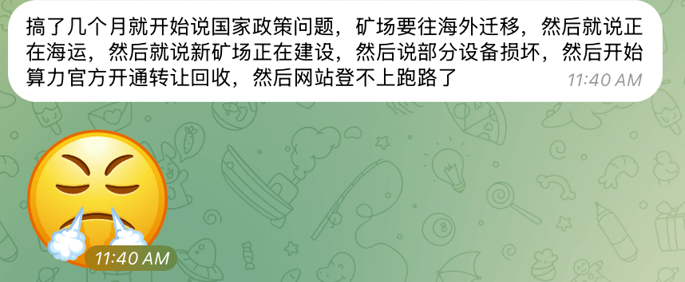

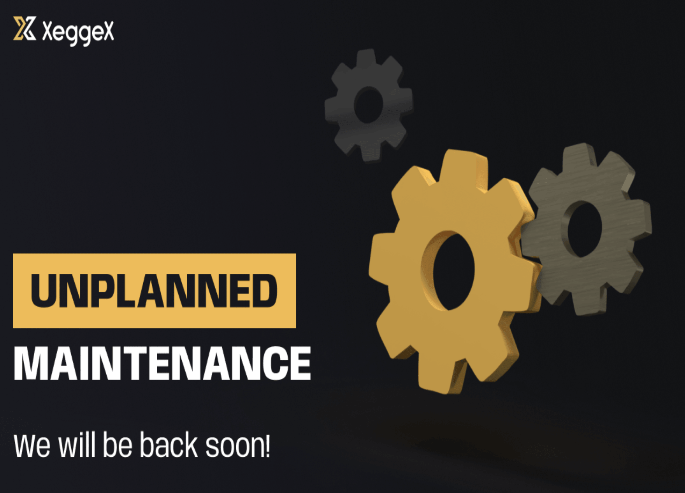

Tip:f2pool矿场推荐页：https://www.f2pool.com/farms#regular

## 10. 矿场额外的生财有道，倒卖矿机

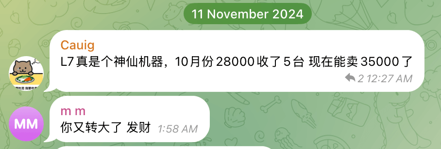