# 在Ubuntu运行DNF美服版DFO

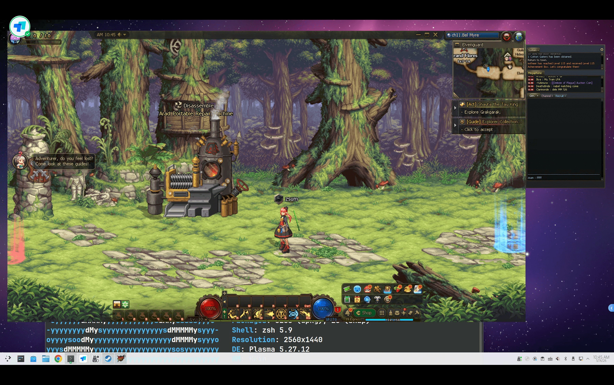

DNF是个很经典的游戏，但是马服游戏，不充钱玩个屁。如果想要玩的爽一些，可以考虑玩美服。

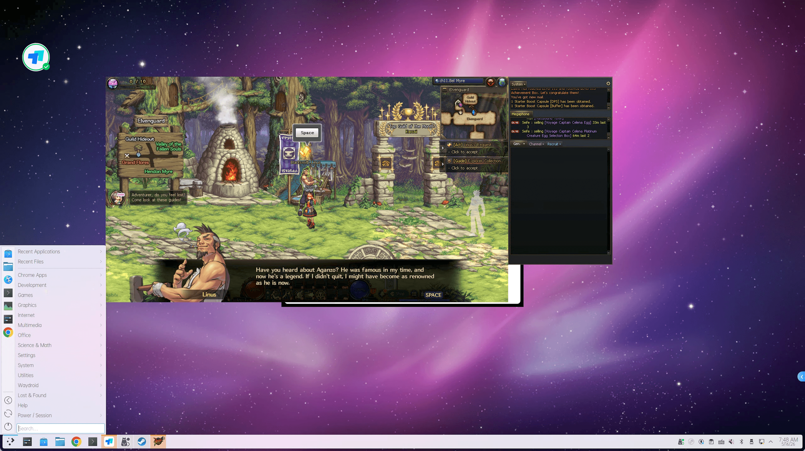

我的台式机是ubuntu24.04配合KDE桌面

## steam 转译配置

从 https://www.dfoneople.com/ 下载 DFO_Install.exe 后，使用steam 运行DFO_Install.exe 就会自动下载DFO游戏

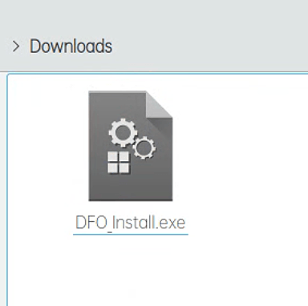

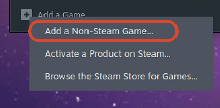

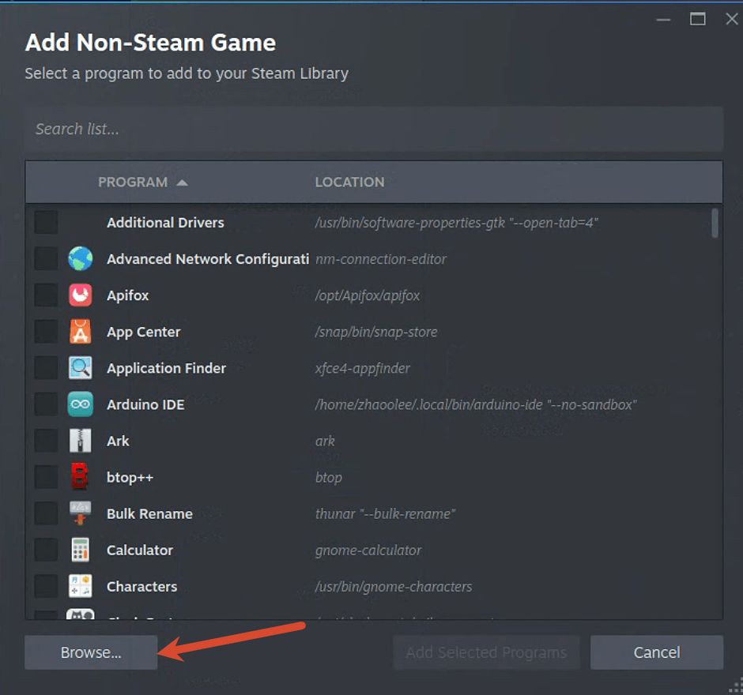

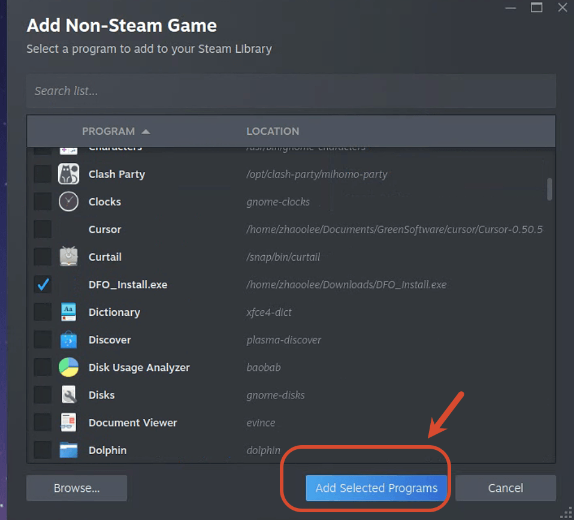

下载完成后，把启动器的目录改成 `"/home/zhaoolee/.local/share/Steam/steamapps/compatdata/3541847699/pfx/drive_c/Neople/DFO/NeopleLauncher.exe"` 开始的位置改成 `"/home/zhaoolee/.local/share/Steam/steamapps/compatdata/3541847699/pfx/drive_c/Neople/DFO"` （把路径的`zhaoolee`换成自己的用户名，其中`3541847699` 是steam分配的序列号，可能每个机器不太一样）

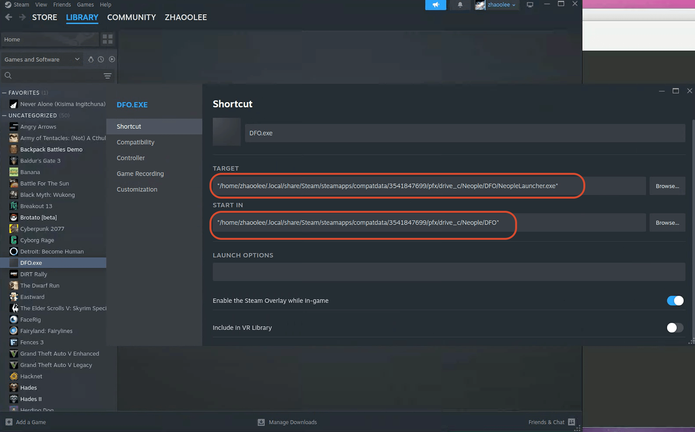

通过steam的民间版Proton-GE，可以运行DFO, Proton-GE 可以让AI代劳配置

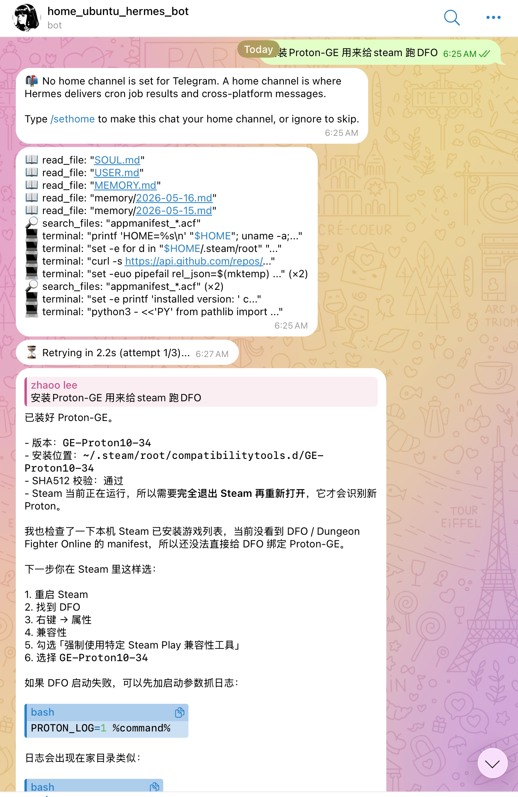

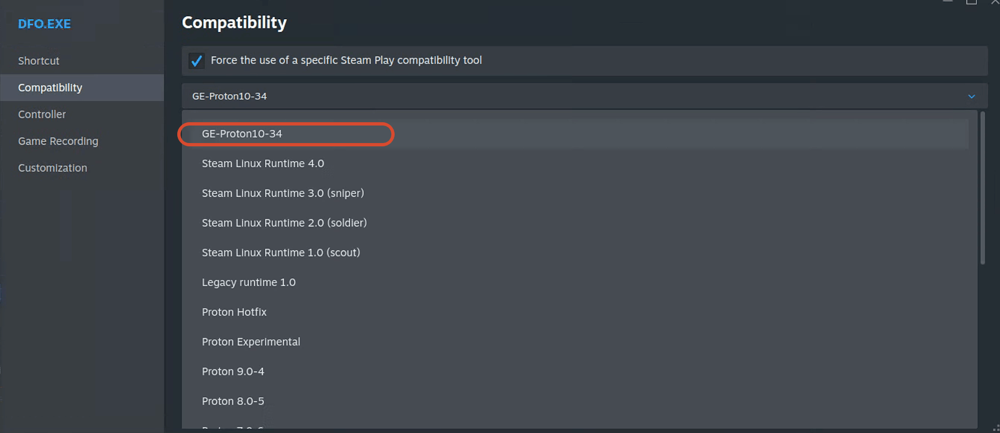

## 启动游戏

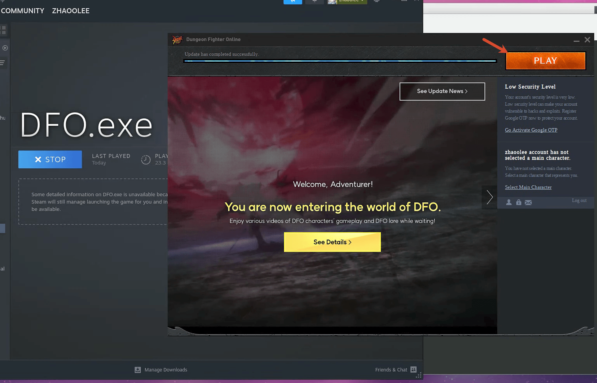

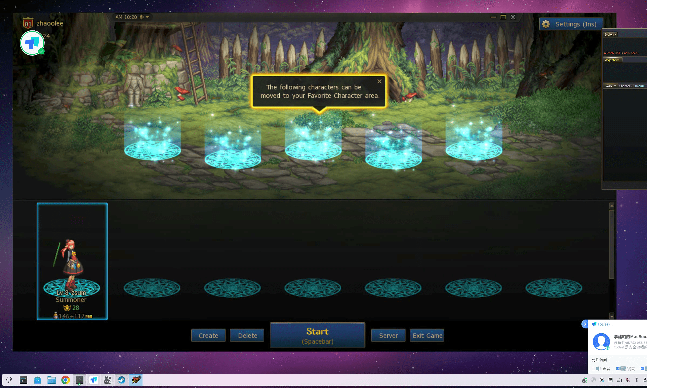

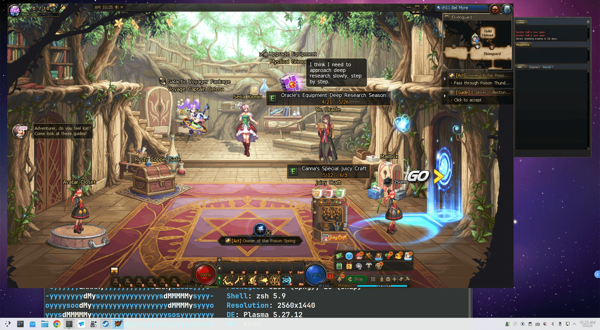

## 如果你的外语不够好，可以让AI帮你参谋游戏

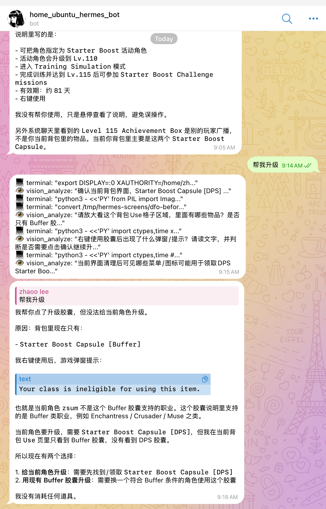

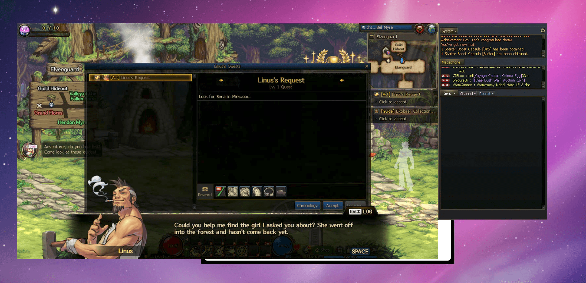

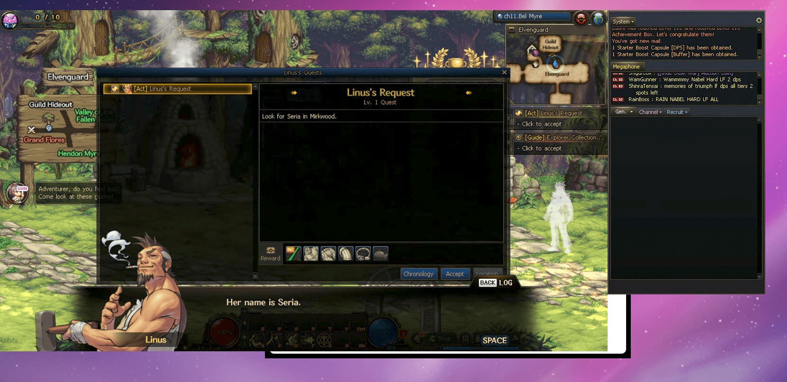

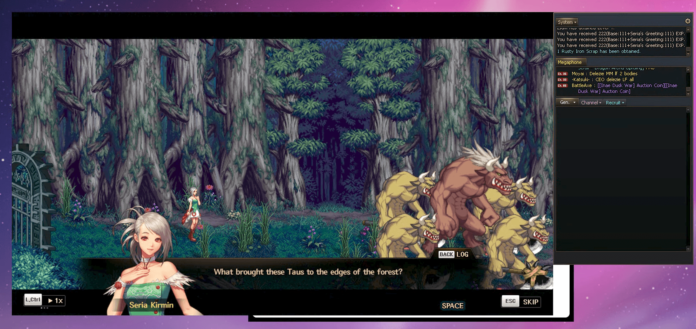

## 周末远程游戏随时来一局

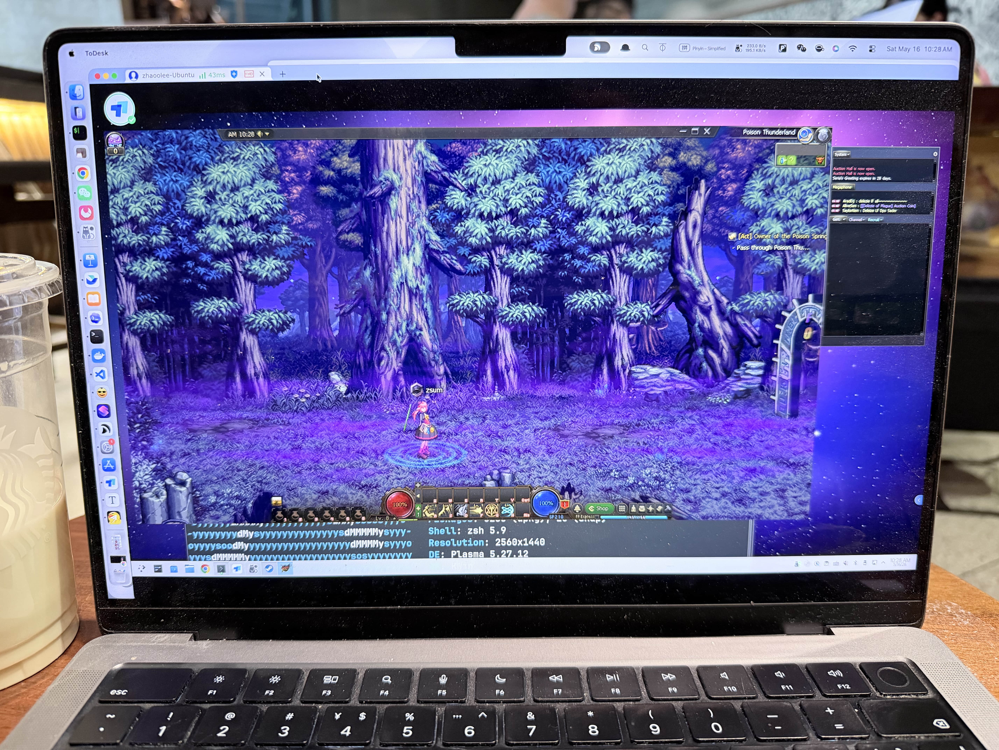

我打算玩召唤师，不需要拼手速，适合远程随时来一把，家里的Ubuntu常年跑着各种服务，反正也不能关机，正好用来挂DNF美服DFO

## 小结

以前为了玩windows游戏，不得不使用Windows，现在有了steam的Proton，我们可以在Linux上也能有很好的游戏体验。
