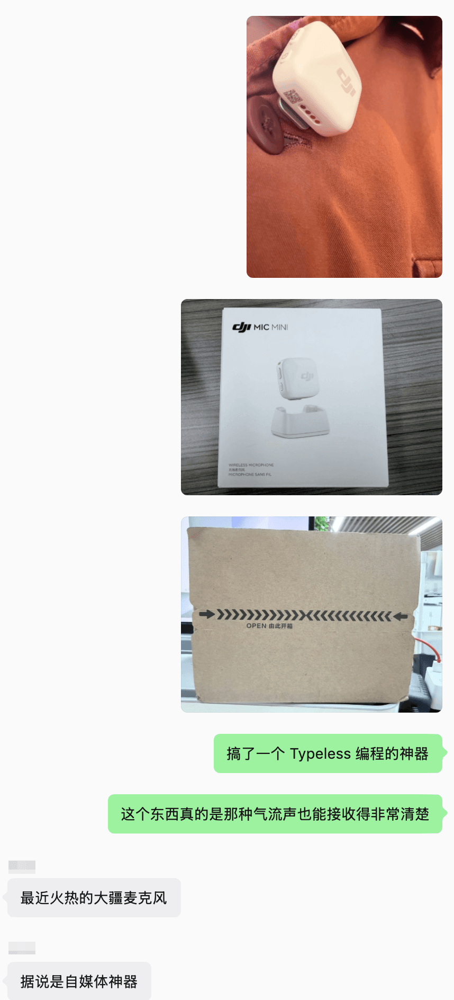
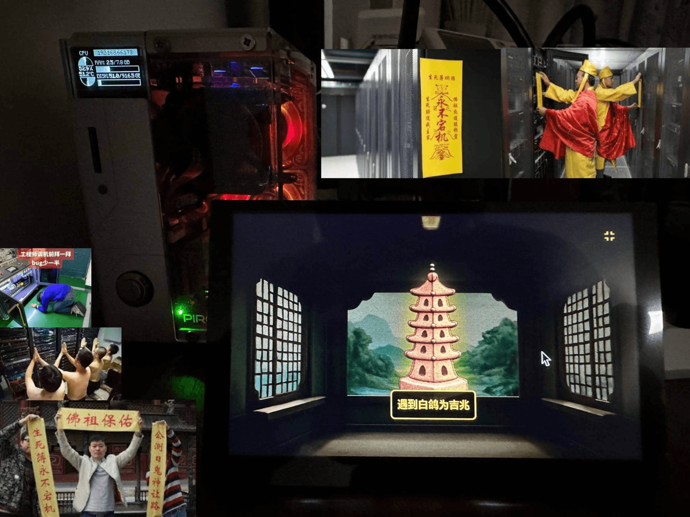
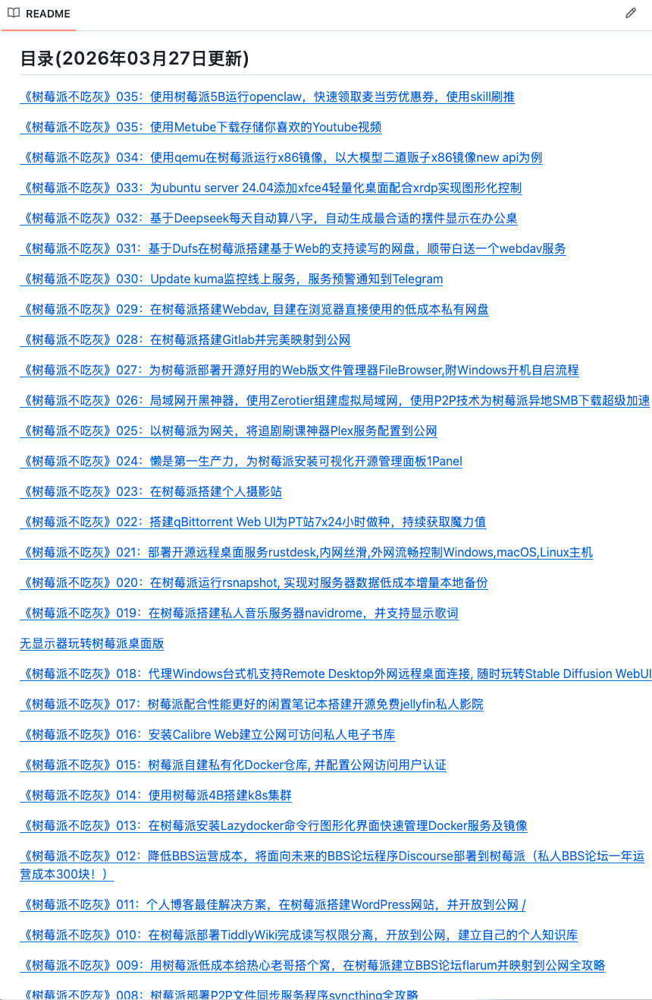

软件买错了，大不了卸载，退订；硬件买错了，占地方、吃灰、出二手都麻烦。所以这份清单不会追求“看起来很酷”，而是更关注它在日常里是不是真的能持续发挥价值。

内容会按倒序更新，最新加入的硬件放在最上面。这样每次打开文章，先看到的都是最近正在用、最近值得记录的东西。

## [33. DJI Mic：语音输入和录制神器](https://www.dji.com/mic)

DJI Mic 很适合用在语音输入、视频录制、会议收音这些场景里。

如果你经常用 Typeless 这种语音输入软件，外置麦克风会明显改善识别稳定性。尤其是在 Vibe Coding 场景里，能少打字就少打字，能少受噪音影响就少受噪音影响。

它的好处是足够即插即用，不需要把自己变成音频工程师。

## [32. Keychron 键盘：可客制、可热插拔、支持多系统](https://www.keychron.com/)

Keychron 的优势是对 Mac 比较友好。

很多机械键盘需要自己适配键位，而 Keychron 基本开箱就能比较舒服地配合 macOS 使用。它不一定是最极客的键盘，但很适合长期打字。

图片里的评价是：可客制、可热插拔、支持多系统，兼具手感与颜值。

## [31. NUC：极简、小巧、可扩展](https://www.asus.com/displays-desktops/nucs/)

NUC 很适合做软路由、轻量工作站、小型服务器。

它的优势是体积小、功耗低、扩展性比单板机更强。对于想要一台长期在线机器，但又不想摆一台大主机的人来说，NUC 是很舒服的选择。

## 30. 机械版翻页时钟：桌面氛围神器

机械翻页时钟没有太多功能，但很有桌面氛围。

它能让桌面从纯粹的工作区域，变成稍微有一点生活感的地方。对每天长时间坐在电脑前的人来说，这种小物件也会影响心情。

## 29. 升降桌：久坐程序员的续命装备

图片里的评价是：投资健康。

升降桌的意义不是让你一直站着办公，而是给身体换姿势的机会。长时间坐着写代码，对腰、肩、颈都不友好。能站一会儿，已经是很大的改善。

## [28. Jetson Nano：能跑真实 AI 模型的迷你 GPU 板](https://developer.nvidia.com/embedded/jetson-nano)

Jetson Nano 的定位很明确：极客的入门 AI 主机。

它可以跑一些真实 AI 模型，也适合做边缘计算、视觉识别、机器人实验。比起纯软件模拟，拿一块真实硬件跑起来会更有感觉。

## 27. 远程开机卡：控制电脑远程开机

远程开机卡适合放在家里的工作站或服务器上。

有时候机器不在身边，但你需要远程启动电脑，这类设备就能派上用场。它不是每天都用，但真正需要的时候会很救命。

## [26. Kindle：显示付款码，扫码提需求](https://www.amazon.com/kindle)

Kindle 在这张清单里的用法很有梗。

它不只是看书，还可以显示付款码，别人扫码提需求。对程序员来说，这是一种很轻量的“需求入口管理系统”。

## 25. 对拷线：Windows 与 macOS 跨操作系统共享剪贴板

对拷线适合在两台电脑之间快速传文件、共享剪贴板。

图片里提到的是 Windows 与 macOS 跨操作系统共享剪贴板。这个小工具不华丽，但在特定场景非常省事。

## 24. Windows 装机启动盘：程序员的社交货币

图片里的评价是：串门儿帮人修电脑的万能神器。

Windows 装机启动盘看起来普通，但它往往是程序员身边最有“江湖地位”的小工具。别人电脑坏了，你能拿出启动盘，基本就能开始表演。

## 23. NVMe 移动硬盘盒：随身携带的工作站高速盘

NVMe 移动硬盘盒适合放项目、素材、虚拟机、备份。

它的优势是速度快、体积小、可替换硬盘。对经常在多台电脑之间移动工作环境的人来说，这比普通 U 盘可靠得多。

## 22. 国产面板高性价比 Type-C 便携屏幕：移动第二屏

便携屏幕适合经常外出办公的人。

图片里的评价是：随身携带的“移动第二屏”，写代码、开 Terminal 都更高效。尤其是看文档 + 写代码，或者日志 + 终端同时打开时，第二屏确实能提升效率。

## [21. PineTime：便宜、可编程、续航长的智能手表](https://pine64.org/devices/pinetime/)

PineTime 是极客界很有意思的小手表。

它不追求豪华功能，而是便宜、可编程、续航长。对喜欢自己改固件、写小程序的人来说，这类设备很有吸引力。

## [20. 8BitDo 游戏手柄：自带 D 模式，可当“可编程键盘”](https://www.8bitdo.com/)

8BitDo 手柄的优势是便宜、好看、兼容性强。

图片里的评价是：自带 D 模式，可当“可编程键盘”，写代码也能用的游戏手柄。它的妙处在于，本来是游戏设备，但可以被程序员拿来做奇怪又实用的事情。

## 19. KVM 切换器：两台电脑，一套键鼠，一个显示器

KVM 切换器是多电脑用户的效率神器。

如果你同时有台式机、笔记本、软路由调试机，KVM 可以让它们共用一套键鼠和显示器。减少桌面线材，也减少来回插拔的麻烦。

## [18. PinePhone：能运行主流 Linux 发行版的开源手机](https://pine64.org/devices/pinephone/)

PinePhone 的意义不在于替代 iPhone 或 Android 旗舰机。

它更像是一台手机形态的 Linux 实验设备。能运行主流 Linux 发行版，可折腾，又足够极客。

## [17. Flipper Zero：解码、模拟、刷卡的小海豚](https://flipperzero.one/)

Flipper Zero 是很典型的极客玩具。

它可以用来研究无线信号、NFC、红外、门禁卡模拟等场景。图片里的评价是：程序员用来解码、模拟、刷卡，玩得不亦乐乎的“小海豚”。

## [16. PS5 手柄：触控板可以作为 Linux 的鼠标](https://www.playstation.com/accessories/dualsense-wireless-controller/)

PS5 手柄不仅能玩游戏，也能作为 Linux 下的输入设备。

图片里特别提到：手柄的触控板可以作为 Linux 的鼠标。这个用法很有程序员式的巧劲。

## [15. GL.iNet：能随身携带的 OpenWrt 路由器](https://www.gl-inet.com/)

GL.iNet 很适合出差、临时组网、旁路由和网络实验。

它的优势是小巧、可玩性强，很多型号原生支持 OpenWrt。对经常折腾网络的人来说，这类随身路由器非常实用。

## [14. 罗技 MX 系列：永远会有人买](https://www.logitech.com/)

MX 系列很适合长时间办公和开发。

它的滚轮、侧向滚动、多设备切换都很实用。尤其是经常在浏览器、编辑器、表格、设计稿之间切换的人，会比较容易感受到它的价值。

鼠标不是越轻越好，工作鼠标更重要的是稳定、顺手、少误操作。

## [13. Synology：NAS 中的 MacBook](https://www.synology.com/)

群晖 NAS 的核心价值是让数据集中起来。

照片、电影、文档、备份、Docker 服务，都可以放到 NAS 上统一管理。它不是最便宜的存储方案，但胜在系统成熟、稳定，适合长期运行。

图片里的评价是：超级稳定的 NAS 系统主机，NAS 中的 MacBook。

## [12. ESP32：二十块钱的国货嵌入式开发板](https://www.espressif.com/en/products/socs/esp32)

ESP32 带 Wi-Fi 和蓝牙，价格便宜，资料丰富。

它很适合做传感器、物联网、小屏幕、自动化控制这些小项目。二十块钱就能买到一个能联网、能跑代码的小玩具，非常适合入门嵌入式。

## [11. HHKB：六十键，传家宝小键盘](https://hhkeyboard.us/)

HHKB 是程序员键盘里很有代表性的存在。

它配列极简、手感稳定、价格不便宜，但很多人一用就是很多年。图片里的评价很准确：六十键，传家宝小键盘。

## 10. 二手 iPad 外接键盘装 Terminus 跑 SSH：在咖啡店修服务器神器

这套组合非常适合轻量远程维护。

二手 iPad 便宜，外接键盘后能处理文字输入，再配合 Terminus 跑 SSH，在咖啡店临时修服务器很有画面感。

## [9. Steam Deck：玩 + 开发两不误](https://store.steampowered.com/steamdeck)

Steam Deck 的价值不只是掌机。

它更像是一台可以随手拿起来玩的 Linux 游戏电脑。很多原本只能坐到电脑前玩的游戏，变成了可以躺着、坐着、出门带着玩的东西。

如果你本来就有 Steam 游戏库，Steam Deck 会让那些吃灰的游戏重新获得出场机会。

## [8. ZimaBoard：树莓派不够用、NUC 太贵之间的平衡](https://www.zimaspace.com/)

ZimaBoard 更像是一块适合做家庭服务器的 x86 小板。

它比树莓派更适合跑一些 x86 服务，也比 NUC 更有折腾感。图片里的评价很准确：它是“树莓派不够用、NUC 太贵”之间的完美平衡。

## 7. NVIDIA GPU：不会拒绝崭新的 90 系显卡

对程序员来说，NVIDIA GPU 不只是游戏装备。

它可以跑本地 AI、做 CUDA 实验、训练小模型、做图形开发，也可以单纯在工作之后打游戏放松。图片里的说法很直白：程序员不会拒绝崭新的 90 系显卡。

## 6. 自攒 PC / Hackintosh：程序员的成年礼

自攒 PC 是理解电脑硬件最直接的方式。

从主板、CPU、显卡、内存、硬盘、电源到散热，全部自己选、自己装、自己排查问题。Hackintosh 更像是进阶版折腾，虽然现在它的实用性不如以前，但作为程序员的折腾经历，确实很有仪式感。

## [5. System76：真正属于 Linux 的电脑](https://system76.com/)

System76 是为 Linux 用户准备的电脑。

如果你希望买回来就是 Linux 友好的状态，不想再和驱动、固件、兼容性反复拉扯，System76 这类机器会很有吸引力。

## [4. Framework：钱可以买到自由](https://frame.work/)

Framework 的核心卖点是可维修、可升级、可替换。

很多笔记本越来越像一次性产品，Framework 则反过来，把模块化和可维护性摆到台面上。它未必适合所有人，但非常适合在意硬件自由度的人。

## [3. 树莓派：生活中 90% 的问题，都可以先试试用树莓派解决](https://www.raspberrypi.com/)

[树莓派不吃灰](https://github.com/zhaoolee/pi)

树莓派最适合拿来做一些长期运行的小服务。

比如内网工具、轻量脚本、下载机、监控面板、实验环境，都可以放在树莓派上跑。它不一定性能强，但胜在功耗低、体积小、社区资料多。

对喜欢折腾的人来说，树莓派不是一台电脑，而是一块可以长期在线的实验田。

## 2. 二手 ThinkPad 安装 Linux：垃圾佬的快乐

二手 ThinkPad 很适合拿来装 Linux。

它便宜、耐造、资料多，坏了也不太心疼。对程序员来说，这类机器的快乐不只是使用，而是从拆机、换硬盘、装系统、调驱动，到最后跑起来的整个过程。

## [1. MacBook Pro：买不亏](https://www.apple.com/macbook-pro/)

图片里的评价是：性能 + 续航 + 生态 + 颜值。

MacBook Pro 适合作为长期主力机。它最重要的价值不是跑分，而是稳定、省心、续航好，能把写作、开发、修图、剪视频这些事情放在同一台机器上完成。

如果你每天都要长时间面对电脑，主力机的稳定性会直接影响工作状态。电脑这东西，少折腾就是生产力。

硬件不是越多越好。

真正重要的是，留下少数几个可信任的设备，然后把它们接进自己的生活和工作流里。
