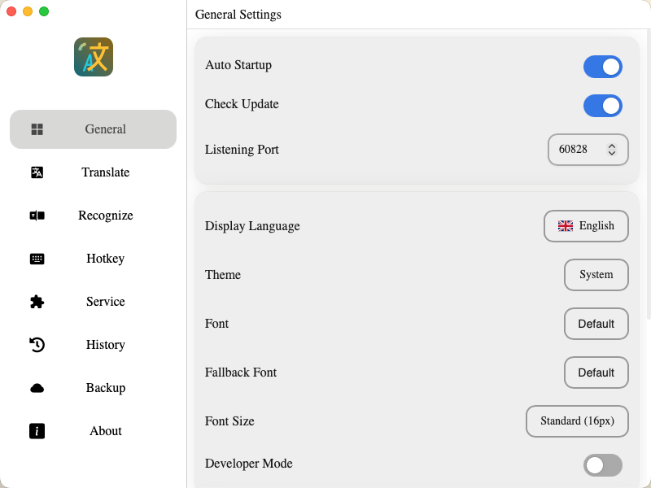
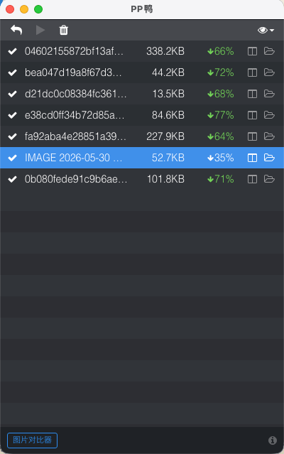
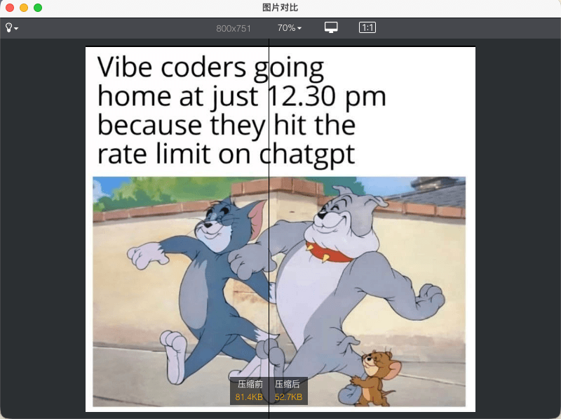
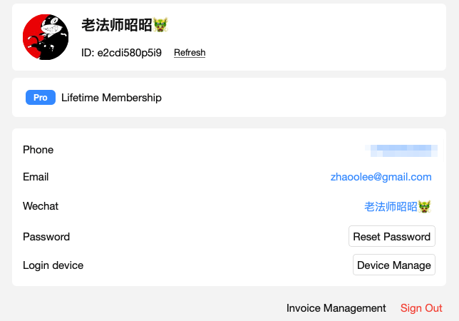
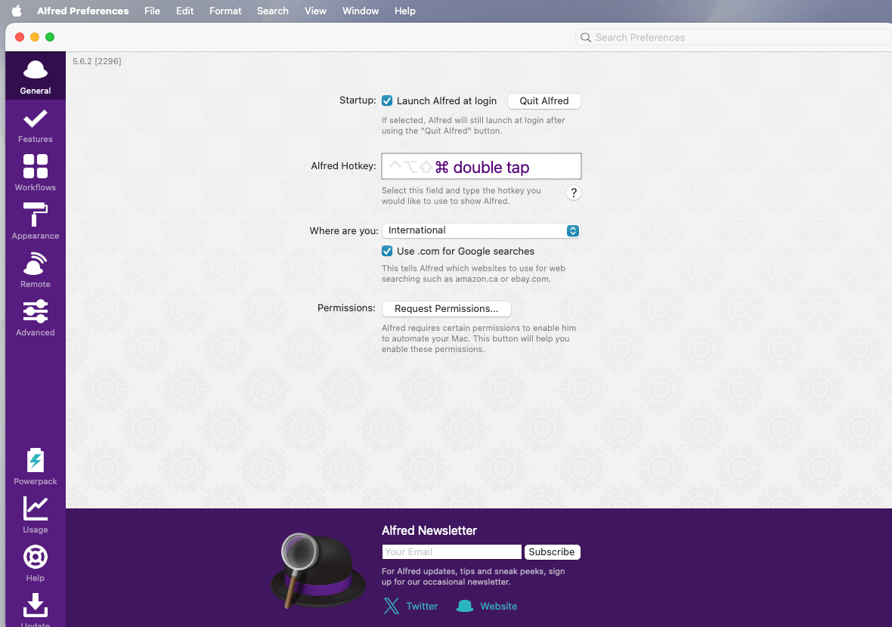
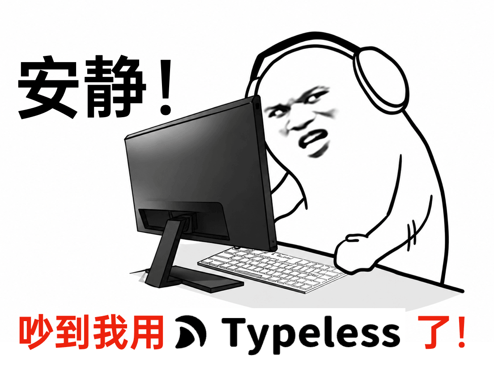
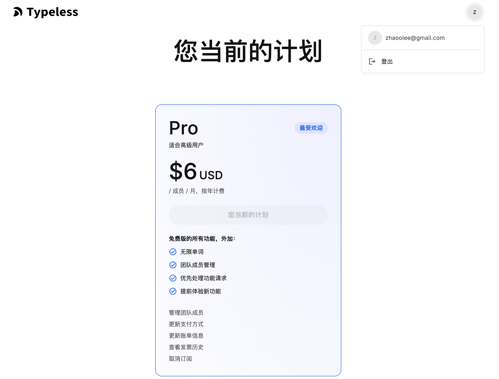
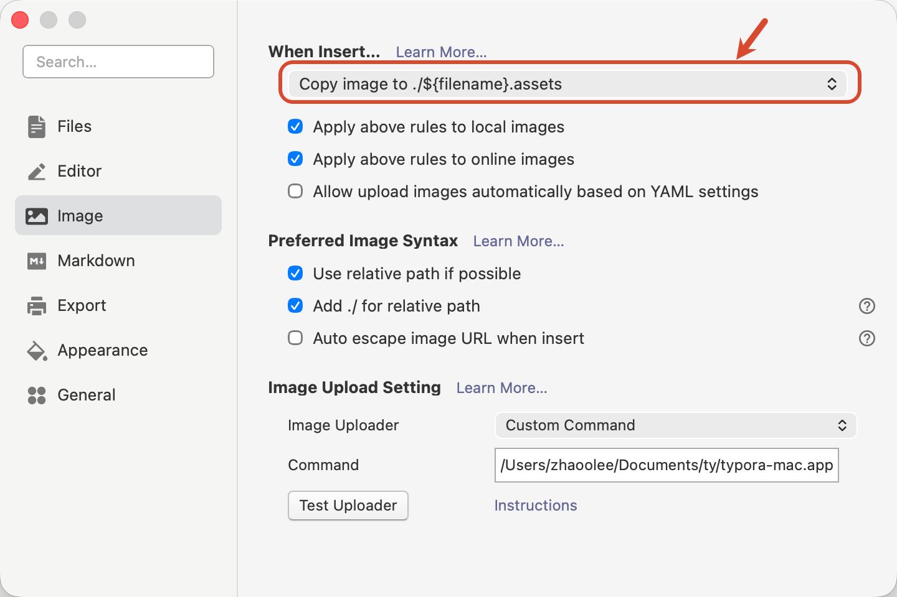

我一直觉得，真正能留下来的软件，往往不是“功能最多”的那个，而是能稳定嵌进日常工作流的那个。

这个专题主要记录我自己长期使用的软件。标准也很简单：可以帮我节省时间，少受一点折腾，让我对自己的数据更有掌控感。

内容会按倒序更新，最新加入的软件放在最上面。这样每次打开文章，先看到的都是最近正在用、最近值得记录的东西。

## [11. Pot：一个使用 OCR 自动翻译的开源跨平台软件](https://pot-app.com/)

对屏幕框选截图后，会自动 OCR，然后调用常用免费接口，并行翻译，也支持离线，也提供接口调用，完美的翻译软件！

## [10. PPduck：图片压缩软件，可买断](https://ppduck.com/)

一个主打视觉无损的图片压缩软件，使用丝滑，交互流畅。

我写了一个开源版，名为 bbduck，支持 skill 调用：[zhaoolee/bbduck](https://github.com/zhaoolee/bbduck)

## [9. Gifox：丝滑的 GIF 制作软件，可买断](https://gifox.app/)

小而美的制作 GIF 的软件，免费版有水印，付费版无水印，能自动录制键盘和鼠标事件，使用起来很丝滑。

## [8. PixPin：国产软件，可买断](https://pixpin.com/)

免费使用，可长截图，可录视频，可 OCR，在 macOS 难有平替。（非刚需的功能需要会员，如果想支持开发团队，可终身买断，大概一百多块钱）

## [7. RustDesk：远程软件，可买断](https://rustdesk.com/)

付费的国产 ToDesk 死活不支持树莓派的远程桌面，但免费版的 RustDesk 支持得很好！

## [6. Plex：非国产软件，可买断](https://www.plex.tv/)

Plex 可以自动为硬盘的电影进行刮削，生成优雅的海报墙。配合树莓派挂 PT 站，观影无比舒适！

可以参考我往期的教程：[付费版的 Plex 比免费开源的 Jellyfin 好用在哪儿？](https://github.com/zhaoolee/pi/blob/main/_posts/2024-01-05-15-57-07-plex.md)

## [5. Alfred：经典稳定的启动软件小工具，可买断](https://www.alfredapp.com/)

Alfred 是 macOS 启动台的替代品，我用 Alfred 有 10 年了，这个软件真的是稳！

## [4. Clash Party：科学上网工具，开源软件](https://clashparty.org/)

GitHub：[mihomo-party-org/clash-party](https://github.com/mihomo-party-org/clash-party)

这个软件最大的优势就是它可以设置一些相对复杂的 DNS 分流规则。

如果你的公司内网限制得很严格，Clash Party 可以让你在科学上网的同时，又能够使用公司内网的各类服务。我的实践攻略：[公司内网使用 Clash Party TUN 模式，保持内部 DNS 解析内部域名的技巧](https://zhaoolee.com/work/2026-01-12-network/)

**付费 VPN 科学上网工具推荐**：通用网络加速器，为科技工作者创造价值。如果你想获得稳定高速的科学上网体验，zhaoolee 推荐一家小众但非常稳定的 VPN 供应商 GLaDOS（提供 vmess 方式），看 YouTube 1080P 不卡。注册登录后，后台提供 iOS 端美区 App 的下载账号。

体验链接：[GLaDOS](https://glados.rocks/landing/OFQTF-AA9NU-I0JVK-11AY8)

短链接：[i.v2fy.com/vpn](http://i.v2fy.com/vpn)

## [3. ZeroTier：局域网共享神器，可服务端自建](https://www.zerotier.com/)

## [2. Typeless：氛围编程必备软件，可学生优惠订阅](https://www.typeless.com/)

Typeless 的核心价值是让你少打字，非常适合 Vibe Coding 场景。它可以使用气流声讲话，也就是“古神的低语”，和 DJI 的麦克风是天作之合。

作为一个年费用户，我还专门开了一个仓库，去分享使用经验：[zhaoolee/typeless](https://github.com/zhaoolee/typeless)

通过这个链接注册，你和作者都可以获得 5 美元赠金：[Typeless 推荐注册](https://www.typeless.com/refer?code=I238ZPZ)

## [1. Typora：Markdown 写作神器，可买断](https://typora.io/)

Typora 一如既往的稳健，`Copy image to ./${filename}.assets` 的图片存储方式，真的是优雅，再也不用担心找不到图片了。

在我长达 6 年的使用过程中，Typora 从没有掉过链子。我还为它写了一个图床插件：[EasyTypora](https://github.com/zhaoolee/EasyTypora)，可以把图片自动储存到自己的服务器。

