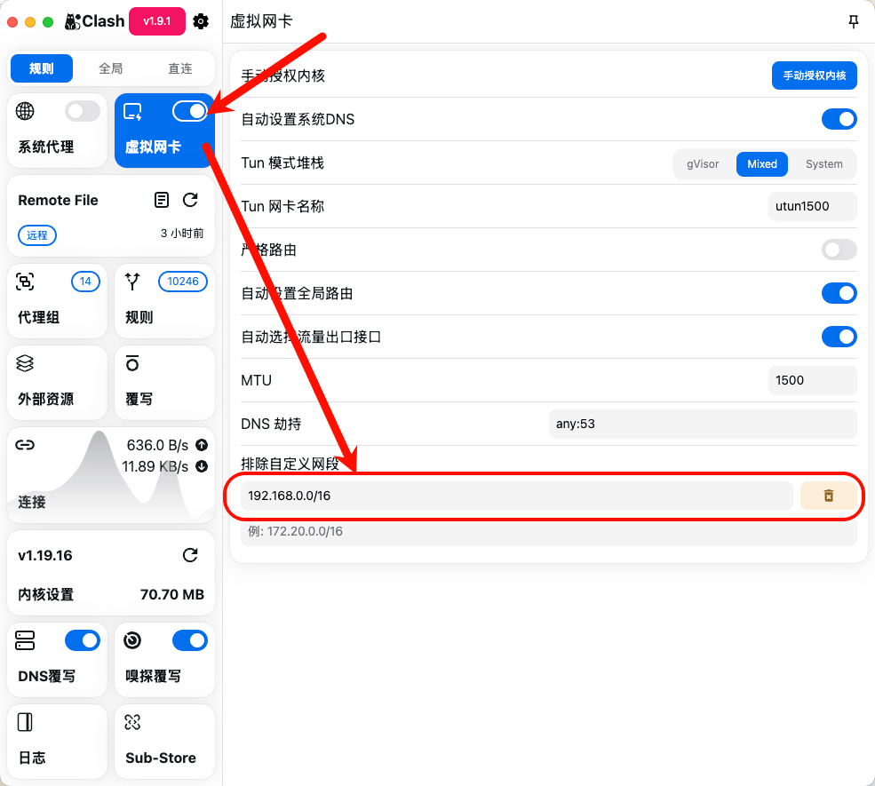
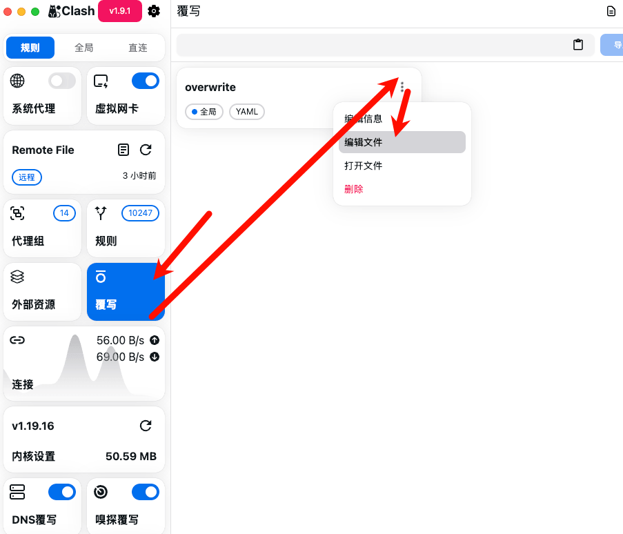
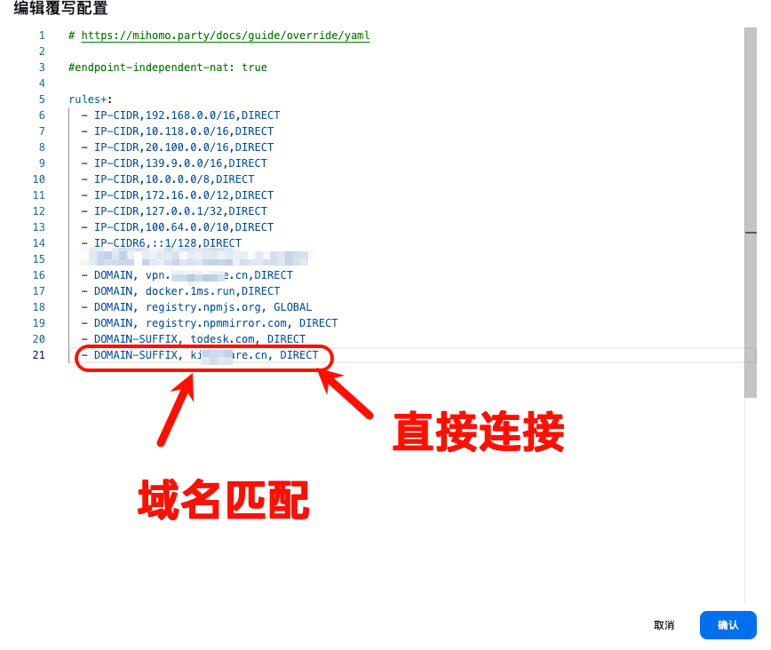
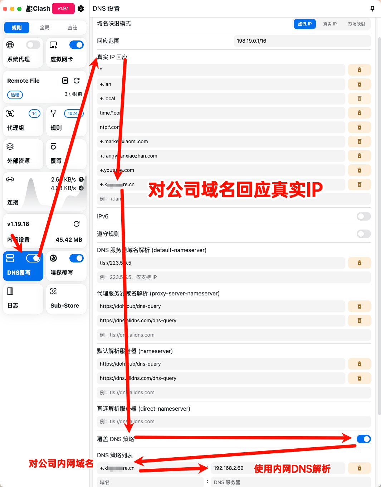

## Clash Party 的Tun模式是如何工作的

Clash Party（以及大多数 Clash 客户端）的 TUN 模式是一种系统级的网络接管技术。它的核心原理是欺骗操作系统，让系统认为有一个新的“物理网卡”存在，从而把所有网络流量都“吸”进去。

收到请求 -> Tun网卡 -> (Clash 立即返回假 IP) -> 建立连接 -> Clash 在后台进行远端解析/分流

## 「覆写」有什么用？

机场提供的订阅文件通常是“只读”的。覆写功能允许你在不修改原订阅文件的情况下，注入你自己的个性化设置。

## 「DNS覆写」有什么用？

让公司内网的域名，可用于内网的域名解析，

同时配合「覆盖DNS策略」，可以只让特定域名走内网

配合「真实IP回应」，可以让内网服务器IP显示在浏览器


### 如何查看dns

```
scutil --dns | grep nameserver
```

## 为什么要开「Tun模式」？

完美接管所有请求

接管无代理配置的软件：很多软件（如 Outlook、终端、游戏）不走系统代理设置，只有开 TUN 模式才能强制它们走 Clash。

处理 DNS 污染：强制所有 DNS 查询经过 Clash 的加密通道，防止被运营商劫持。


## 如何在办公网络下能同时支持内网DNS与tun模式的科学上网

1. 设置排除自定义网段，比如我的办公室网络有192.168.*.* 就排除自定义网段 192.168.0.0/16




2. 添加覆写规则，匹配公司一级域名作为后缀，添加直连





3. 对公司一级域名回应真实IP，并使用内网DNS解析



