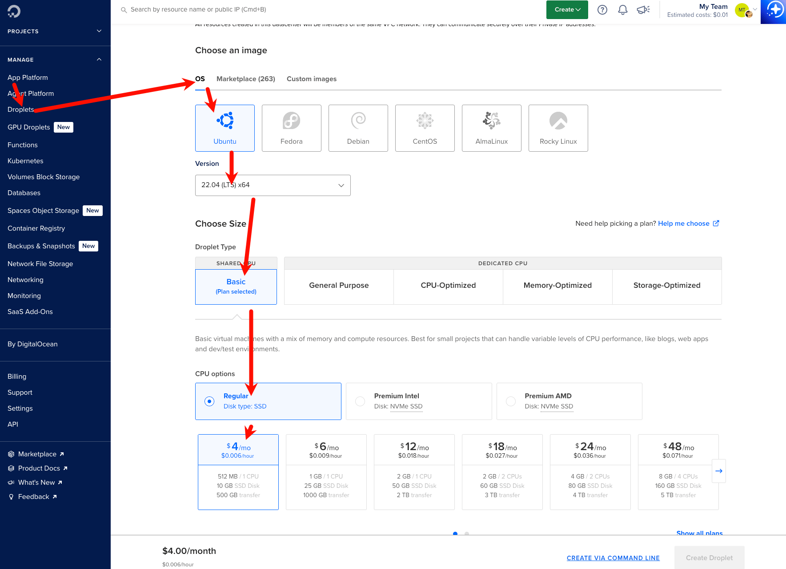
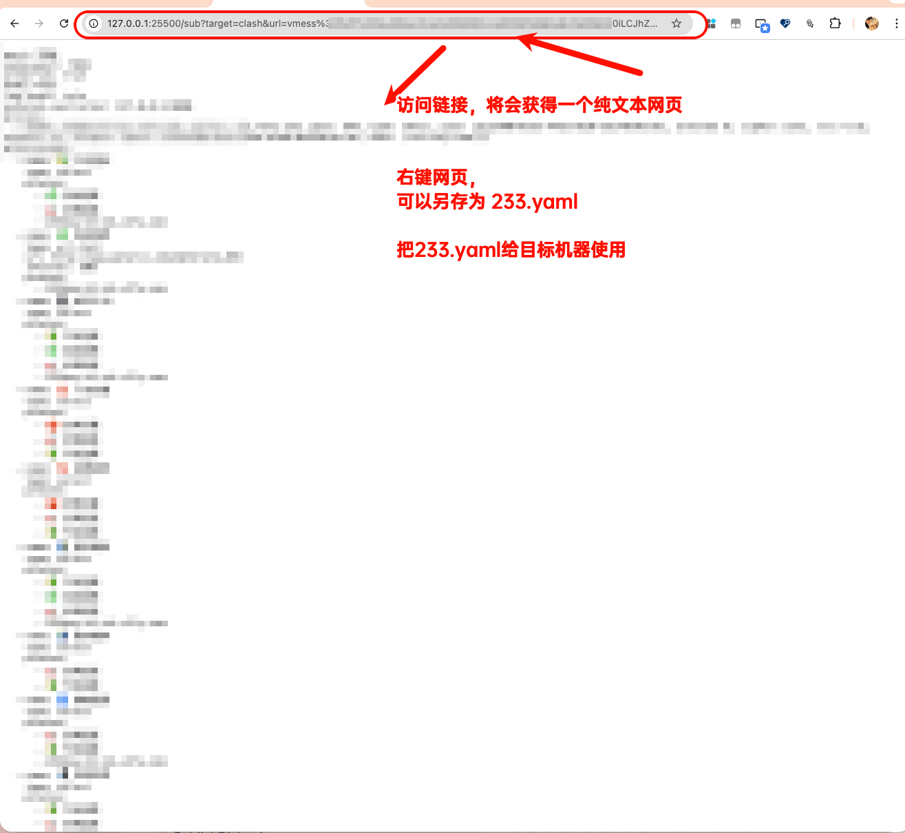
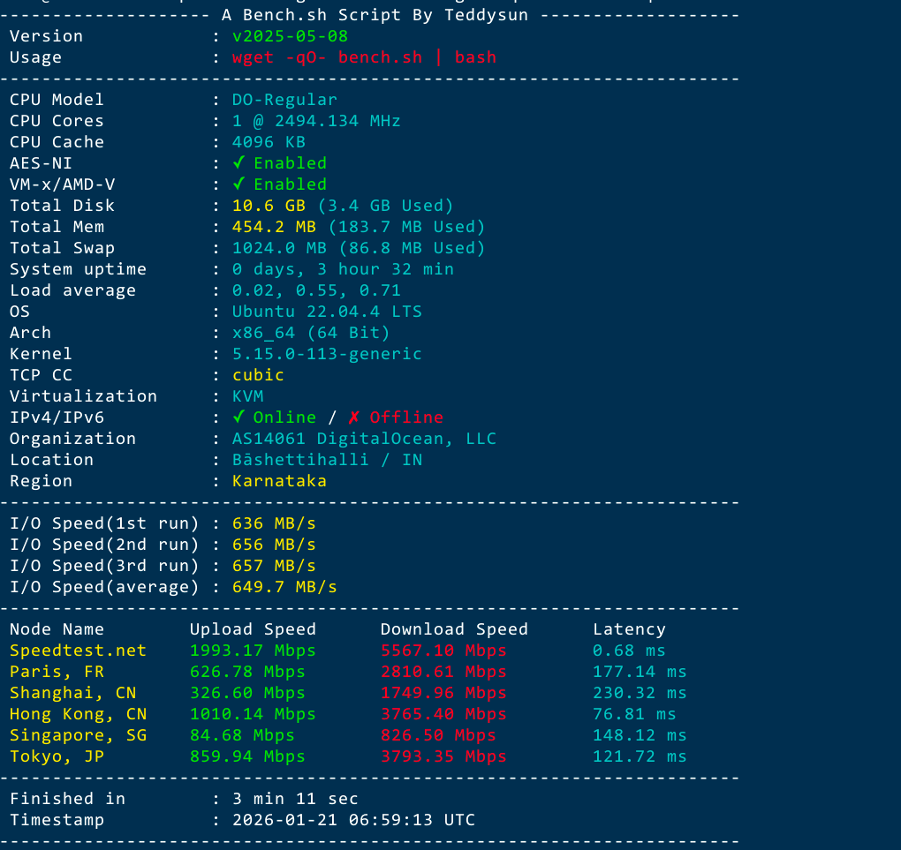
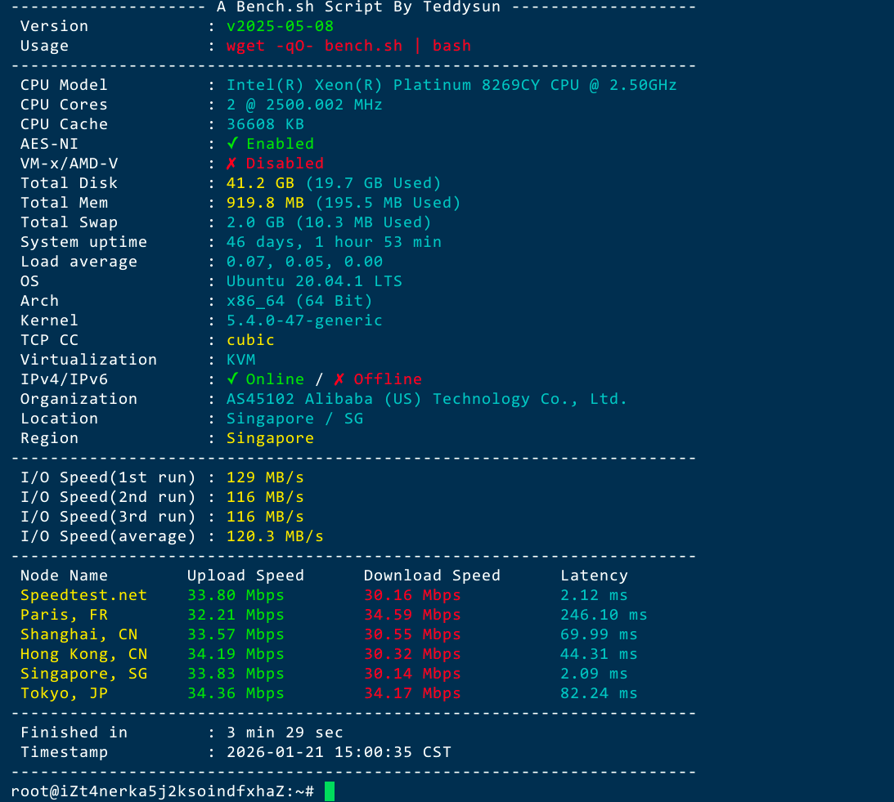

# 从DigitalOcean搞个4美刀每月的印度IP穷鬼套餐，订阅印度区油管，每月500GB流量，上行1000MB，下行5000MB

## 印度IP的好处

目前油管会员家庭组严查IP，美区个人订阅贵的要死，很多低价区类似土耳其区风控超级严格，而印度区的价格适中，风控也没那么严格，成为奈飞小铺等代充平台充值油管会员的唯一选项。

但是油管在用户订阅成功后，油管依然会核查用户是否使用印度地区的IP进行浏览，所以搞个低价的印度区IP作为出口，成为一个切实的需求

经过我多天的研究，发现digitalOcean每月4刀，每月500GB流量的印度服务器是兼具了性价比，稳定性，支付便利性的选择(digitalOcean 支持国内支付宝支付，对国内用户非常友好)



直接连接 https://cloud.digitalocean.com/droplets/new?i=47d171&region=blr1&size=s-1vcpu-512mb-10gb&distro=ubuntu&distroImage=ubuntu-22-04-x64


## 开机后，通过ssh连接，我们需要为512MB内存的机型，创建1GB Swap（交换分区），否则系统在运行或安装软件时极易因为内存不足（OOM）而崩溃

```
# 创建文件
sudo fallocate -l 1G /swapfile
# 设置权限（重要）： 出于安全考虑，必须限制只有 root 用户能访问该文件
sudo chmod 600 /swapfile
# 将文件标记为 Swap 空间
sudo mkswap /swapfile
# 启用 Swap
sudo swapon /swapfile
备份 fstab 文件（以防万一）
sudo cp /etc/fstab /etc/fstab.bak
# 写入配置
echo '/swapfile none swap sw 0 0' | sudo tee -a /etc/fstab
# 临时修改（立即生效）：
sudo sysctl vm.swappiness=10
```

为了避免重启后swap失效，需要编辑 sysctl 配置文件 `/etc/sysctl.conf`,在文件底部添加以下行

```
vm.swappiness=10
```


## 安装233boy的v2ray脚本

作者网站 https://233boy.com/v2ray/v2ray-script/

执行以下命令即可

```
bash <(wget -qO- -o- https://github.com/233boy/v2ray/raw/master/install.sh)
```

执行完成后，我们会获得一个类似 `vmess://eyJ2IjoyLC*********0bHMifQ==` 的链接


## 将vmess转换链接为订阅文件

在浏览器（Chrome/Safari/Edge）随便打开一个空白页，按 F12 (或右键 -> 检查) 打开开发者工具。点击 Console (控制台) 标签。输入下面这行代码（把括号里的内容换成你的 vmess 链接），然后按回车（注意括号里面带引号）：


```
encodeURIComponent("vmess://eyJ2IjoyLC*********0bHMifQ==")
```

将会获取一个转换后的字符串，转换后的字符，需要复制下来，复制时不要头部和尾部的引号

## 运行转换服务

```
docker run -d --name subconverter --restart=always -p 25500:25500 tindy2013/subconverter:latest
```

## 获取clash文件

访问以下链接
```
http://127.0.0.1:25500/sub?target=clash&url=粘贴刚才复制的那串字符
```

访问链接后，获取订阅文件，给clash使用




推荐的clash客户端 https://clashparty.org/


## 测速结果

```
wget -qO- bench.sh | bash
```
这是DigitalOcean4美刀每月的印度IP每月500GB流量




没有对比就没有伤害，下面一张是新加坡阿里云的，新加坡阿里云虽然网络慢，但是流量很便宜，24块钱1TB



